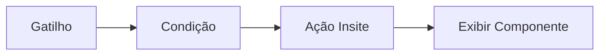

**Nesta página:**

- [O que são componentes](#o-que-são-componentes)
- [Quando usar cada tipo](#quando-usar-cada-tipo)
- [Estrutura de um componente](#estrutura-de-um-componente)
- [Do zero ao componente ativo](#do-zero-ao-componente-ativo)
- [Controle quem vê cada componente](#controle-quem-vê-cada-componente)
- [Defina quando e quantas vezes exibir](#defina-quando-e-quantas-vezes-exibir)
- [Personalize visual e conteúdo](#personalize-visual-e-conteúdo)
- [Conecte componentes às suas automações](#conecte-componentes-às-suas-automações)
- [Teste antes de publicar](#teste-antes-de-publicar)
- [Acompanhe a performance](#acompanhe-a-performance)
- [Boas práticas para componentes eficazes](#boas-práticas-para-componentes-eficazes)

---

## O que são componentes

Componentes são **elementos visuais interativos** que a UserIn injeta diretamente no seu site para engajar visitantes em tempo real. Diferente de conteúdo estático, cada componente se adapta ao perfil e ao comportamento do visitante, exibindo a mensagem certa para a pessoa certa no momento certo.

Toda a lógica de exibição passa pelo **Editor de Fluxos**. Você define quando o componente aparece, para qual audiência e com qual frequência. O resultado: experiências personalizadas que convertem mais sem exigir desenvolvimento no seu time de produto.

A plataforma organiza componentes em quatro tipos, cada um projetado para um contexto de interação diferente:

| Tipo | Formato | Exemplo de uso |
|------|---------|----------------|
| **Cards** | Elementos visuais compactos, fixos ou flutuantes | Destaques, promoções, CTAs contextuais |
| **Modais** | Janelas sobrepostas ao conteúdo da página | Ofertas, captação de leads, comunicados |
| **Smart Blocks** | Blocos embutidos diretamente na página | Banners personalizados, recomendações inline |
| **Mini Games** | Mecânicas interativas de gamificação | Engajamento, recompensas, retenção |

<div className="callout-blue">
  Componentes são sempre acionados via **Editor de Fluxos**. Isso garante que você controle a segmentação, frequência e prioridade de cada exibição com base em dados reais do visitante.
</div>

---

## Quando usar cada tipo

Escolher o componente certo depende do objetivo da interação e do contexto em que o visitante se encontra. Abaixo, cada tipo com seus cenários ideais.

<AccordionGroup>
  <Accordion title="Cards" icon="cards-blank" defaultOpen>
    Cards são componentes visuais compactos que aparecem no site do visitante em formato de cartão. Podem ser fixos em uma posição da página ou flutuantes (acompanhando o scroll).

    **Cenários ideais:**

    - Destacar uma oferta ou promoção contextual sem interromper a navegação
    - Exibir CTAs personalizados em áreas estratégicas da página
    - Mostrar notificações ou alertas visuais com base no comportamento
    - Recomendar conteúdo ou produtos de forma discreta

    Cards funcionam bem quando você quer chamar a atenção do visitante **sem bloquear a experiência**. O formato compacto mantém a navegação fluida.

    [Guia completo de Cards →](/componentes/cards)
  </Accordion>

  <Accordion title="Modais" icon="window-maximize">
    Modais são janelas sobrepostas que aparecem sobre o conteúdo da página. São o formato mais direto de comunicação: capturam a atenção total do visitante por alguns segundos.

    **Cenários ideais:**

    - Ofertas de conversão com senso de urgência (ex: desconto por tempo limitado)
    - Captação de leads com formulário (email, telefone)
    - Comunicados importantes que precisam de confirmação
    - Intervenção em momentos de intenção de saída (exit intent)
    - Boas-vindas personalizadas para novos visitantes

    Modais têm alto impacto, mas precisam de controle de frequência para não se tornarem intrusivos. A UserIn oferece regras de frequência nativas.

    [Guia completo de Modais →](/componentes/modais)
  </Accordion>

  <Accordion title="Smart Blocks" icon="puzzle-piece">
    Smart Blocks são blocos de conteúdo embutidos diretamente na estrutura da página. Eles se integram ao layout existente, ocupando um espaço pré-definido no HTML do site.

    **Cenários ideais:**

    - Banners personalizados que mudam de acordo com o perfil do visitante
    - Recomendações inline dentro de páginas de conteúdo ou produto
    - CTAs contextuais que se adaptam ao estágio do funil
    - Seções dinâmicas que mudam com base em segmentos

    Smart Blocks são a opção mais discreta: o visitante vê conteúdo personalizado sem perceber que é um elemento dinâmico. Perfeitos para experiências que se misturam ao design do site.

    [Guia completo de Smart Blocks →](/componentes/smart-blocks)
  </Accordion>

  <Accordion title="Mini Games" icon="dice">
    Mini Games são mecânicas interativas de gamificação que transformam a experiência do visitante em algo divertido e recompensador. A plataforma oferece seis formatos prontos:

    - **Roleta de prêmios**: o visitante gira a roleta para revelar recompensas
    - **Raspadinha**: revela ofertas ao "raspar" a tela
    - **Flip Card**: cartas que o visitante vira para descobrir o prêmio
    - **Gift Box**: caixas surpresa com animação de abertura
    - **Prize Drop**: mecânica estilo plinko onde o prêmio cai por obstáculos
    - **Slot Machine**: colunas giratórias que sorteiam combinações

    **Cenários ideais:**

    - Aumentar tempo de permanência e engajamento no site
    - Captar leads oferecendo recompensas em troca de dados
    - Reativar visitantes inativos com mecânicas lúdicas
    - Criar campanhas promocionais com alto fator de viralização

    [Guia completo de Mini Games →](/componentes/mini-games)
  </Accordion>
</AccordionGroup>

---

## Estrutura de um componente

Todo componente na UserIn, independentemente do tipo, compartilha uma estrutura base com propriedades comuns. Entender essa estrutura facilita a criação de qualquer componente.

| Propriedade | Descrição | Exemplo |
|-------------|-----------|---------|
| **Nome** | Identificador interno do componente | "Banner Black Friday VIP" |
| **Tipo** | Categoria do componente | Card, Modal, Smart Block ou Mini Game |
| **Conteúdo** | O que o visitante vê (visual + texto) | Template pré-definido ou HTML/CSS customizado |
| **Segmentação** | Quem pode ver o componente | Visitantes do segmento "alta intenção" |
| **Gatilho** | Evento que aciona a exibição | Entrada em segmento, scroll, tempo na página |
| **Frequência** | Quantas vezes o visitante vê | Uma vez por sessão, máximo 3 vezes no total |
| **Status** | Estado atual do componente | Rascunho, Ativo ou Pausado |

<Tip>
  Nomeie seus componentes com um padrão claro. Uma boa prática: **[Tipo] - [Objetivo] - [Audiência]**. Exemplo: "Modal - Oferta 20% - Novos Visitantes". Isso facilita encontrar e gerenciar componentes quando a lista cresce.
</Tip>

Cada tipo de componente adiciona propriedades específicas sobre essa base. Cards incluem configuração de posição, Modais incluem tipo de overlay, Smart Blocks incluem o seletor CSS do container, e Mini Games incluem mecânica e configuração de prêmios.

---

## Do zero ao componente ativo

O processo de criação segue um fluxo consistente para todos os tipos de componente. Aqui está o caminho completo, da ideia ao componente funcionando no seu site.

<Steps>
  <Step title="Defina o objetivo">
    Antes de abrir o editor, tenha clareza sobre três pontos:
    
    - **O que** você quer comunicar (oferta, informação, captura de lead)
    - **Para quem** (qual segmento ou perfil de visitante)
    - **Quando** (em qual momento da jornada)
    
    Essa definição evita retrabalho e garante que o componente tenha um propósito mensurável.
  </Step>

  <Step title="Escolha o tipo de componente">
    Com base no objetivo, selecione o formato mais adequado:
    
    - Quer chamar atenção sem interromper? **Card**
    - Precisa de ação imediata? **Modal**
    - Quer se integrar ao layout da página? **Smart Block**
    - Quer engajar com gamificação? **Mini Game**
    
    Acesse a seção **Componentes** no menu lateral da plataforma e clique em **Criar novo componente**.
  </Step>

  <Step title="Configure o conteúdo visual">
    Escolha entre usar um **template pronto** ou criar um design **customizado** com HTML/CSS. Nos dois casos, você pode usar **variáveis Liquid** para personalizar o conteúdo dinamicamente.
    
    Exemplos de personalização:
    
    ```
    Olá {{contact.firstName:visitante}}! Temos uma oferta especial para você.
    ```
    
    O editor mostra um preview em tempo real para que você valide o visual antes de publicar.
  </Step>

  <Step title="Defina a segmentação">
    Escolha quais visitantes verão o componente. Você pode combinar múltiplas condições:
    
    - Pertencer a um **segmento** específico
    - Ter um **atributo** com determinado valor
    - Ter realizado (ou não) uma **ação** específica
    
    Condições podem ser combinadas com lógica **E** (todas devem ser verdadeiras) ou **OU** (pelo menos uma deve ser verdadeira).
  </Step>

  <Step title="Configure frequência e agendamento">
    Defina quantas vezes e quando o componente aparece:
    
    - **Frequência por visitante**: uma vez, X vezes, uma vez por sessão, ou sem limite
    - **Período de exibição**: data de início e fim (opcional)
    - **Janela de horário**: horários específicos do dia (opcional)
  </Step>

  <Step title="Conecte ao Editor de Fluxos">
    Para que o componente funcione no site, ele precisa estar vinculado a um fluxo no **Editor de Fluxos**. Crie um fluxo (ou use um existente) e adicione a ação de exibição do componente.
    
    O fluxo controla a lógica completa: quando disparar, quais condições verificar e qual componente exibir.
  </Step>

  <Step title="Teste e publique">
    Use o modo de **preview** para validar o componente no contexto real do seu site. Verifique:
    
    - O visual está correto em desktop e mobile?
    - As variáveis estão sendo substituídas corretamente?
    - A segmentação está selecionando a audiência certa?
    
    Quando tudo estiver validado, ative o componente e o fluxo associado.
  </Step>
</Steps>

---

## Controle quem vê cada componente

A segmentação determina **quem** é elegível para ver o componente. Você combina critérios para garantir que cada visitante receba a experiência mais relevante.

### Segmentação por segmentos

A forma mais comum de segmentar componentes é usar os **segmentos dinâmicos** que você já criou na plataforma. O componente só aparece para visitantes que pertencem ao segmento selecionado.

Exemplos práticos de segmentação:

| Segmento | Componente sugerido | Objetivo |
|----------|---------------------|----------|
| Novos visitantes (primeira sessão) | Modal de boas-vindas | Captação de lead |
| Visitantes recorrentes sem conversão | Card com oferta | Incentivo à primeira conversão |
| Clientes inativos há 30+ dias | Mini Game com recompensa | Reativação |
| Visitantes de alta intenção | Smart Block com CTA direto | Aceleração de conversão |

### Segmentação por atributos

Além de segmentos, você pode usar **atributos individuais** do perfil do visitante como critério. Isso permite condições mais granulares:

- `deposits.total > 1000` para exibir componentes exclusivos para clientes de alto valor
- `contact.email != null` para filtrar apenas visitantes identificados
- `behavior.sessionsPerWeek >= 3` para alcançar visitantes engajados

### Combinando condições

Condições podem ser empilhadas com operadores lógicos para criar segmentações precisas:

- **E (AND)**: o visitante deve atender a **todas** as condições simultaneamente
- **OU (OR)**: basta atender a **pelo menos uma** das condições

```
Segmento = "alta intenção"
E atributo deposits.total > 500
E atributo behavior.sessionsPerWeek >= 2
```

Neste exemplo, o componente só aparece para visitantes que pertencem ao segmento "alta intenção", já gastaram mais de R$ 500 e acessam o site pelo menos 2 vezes por semana.

---

## Defina quando e quantas vezes exibir

Além de controlar **quem** vê, você controla **quando** e **com qual frequência** o componente aparece. Isso evita experiências repetitivas e garante que cada exibição tenha impacto.

### Frequência por visitante

A configuração de frequência define quantas vezes um mesmo visitante pode ver o componente:

| Opção | Comportamento |
|-------|---------------|
| **Uma única vez** | O visitante vê o componente uma vez e nunca mais |
| **Uma vez por sessão** | Aparece no máximo uma vez cada vez que o visitante acessa o site |
| **X vezes no total** | Limite máximo de exibições por visitante (ex: 3 vezes) |
| **Sem limite** | Aparece sempre que as condições forem atendidas |

<div className="callout-blue">
  A frequência é rastreada por visitante individual. Se um visitante já viu o componente o número máximo de vezes, ele não será exibido novamente, mesmo que o fluxo seja reativado.
</div>

### Agendamento

Você pode restringir a exibição do componente a um período ou horário específico:

- **Data de início e fim**: ideal para campanhas com prazo definido (ex: Black Friday de 20/11 a 30/11)
- **Janela de horário**: exiba componentes apenas em horários estratégicos (ex: entre 18h e 23h quando o tráfego é mais qualificado)
- **Dias da semana**: restrinja a exibição a dias específicos

### Prioridade entre componentes

Quando múltiplos componentes são elegíveis para o mesmo visitante no mesmo momento, a UserIn usa um sistema de **prioridade**. Componentes com prioridade mais alta são exibidos primeiro. Isso evita conflitos visuais (como dois modais tentando aparecer ao mesmo tempo).

<Tip>
  Configure prioridades pensando na jornada do visitante. Componentes de conversão direta (como ofertas) devem ter prioridade sobre componentes informativos (como banners de conteúdo).
</Tip>

---

## Personalize visual e conteúdo

A aparência do componente é tão importante quanto o momento de exibição. A UserIn oferece três caminhos para configurar o visual, do mais simples ao mais flexível.

### Templates prontos

A plataforma disponibiliza templates pré-configurados para cada tipo de componente. Templates incluem layout, cores e estrutura de texto prontos para uso. Você só precisa personalizar o conteúdo (textos, imagens e CTAs).

Templates são o caminho mais rápido para colocar um componente no ar, especialmente quando você está testando uma hipótese e quer velocidade de execução.

### Editor visual

O editor visual permite ajustar propriedades do template sem escrever código. As alterações são refletidas no preview em tempo real.

| Propriedade | O que você pode ajustar |
|-------------|-------------------------|
| Cores | Fundo, texto e botões |
| Tipografia | Fonte, tamanho e peso |
| Espaçamentos | Margens, paddings e bordas |
| Imagens | Upload de imagens e ícones |
| Textos | Conteúdo dos botões, títulos e CTAs |

### HTML/CSS customizado

Para controle total sobre o visual, você pode criar componentes com **HTML e CSS customizados**. Essa opção é ideal quando:

- Seu time de design tem um padrão visual específico
- Você precisa de layouts complexos que os templates não cobrem
- Quer garantir consistência visual com o restante do site

```html
<div class="userin-promo" style="background: linear-gradient(135deg, #667eea, #764ba2); padding: 24px; border-radius: 12px; color: white; text-align: center;">
  <h2>Olá, {{contact.firstName:visitante}}!</h2>
  <p>Você tem uma oferta exclusiva esperando.</p>
  <a href="/oferta" class="cta-btn" style="background: white; color: #764ba2; padding: 12px 24px; border-radius: 8px; text-decoration: none; font-weight: bold; display: inline-block; margin-top: 12px;">
    Ver minha oferta
  </a>
</div>
```

### Variáveis dinâmicas (Liquid)

Independentemente do caminho escolhido (template, editor ou código), você pode usar **variáveis Liquid** para personalizar o conteúdo com dados reais de cada visitante.

O formato é `{{campo}}`, com suporte a valor padrão via `{{campo:fallback}}`:

| Variável | Resultado | Com fallback |
|----------|-----------|--------------|
| `{{contact.firstName}}` | "João" | `{{contact.firstName:visitante}}` → "visitante" se vazio |
| `{{deposits.total}}` | "2500" | `{{deposits.total:0}}` → "0" se vazio |
| `{{intention.level}}` | "high" | `{{intention.level:padrão}}` → "padrão" se vazio |

O editor de texto inclui um **picker de variáveis** (botão `{ }`) que permite buscar e inserir variáveis sem precisar memorizar os nomes dos campos.

<Note>
  Sempre use valor padrão nas variáveis. Nem todo visitante terá todos os campos preenchidos, e um texto com lacunas vazias prejudica a experiência.
</Note>

Para a lista completa de variáveis disponíveis, consulte o [guia de personalização com variáveis](/plataforma/personalizacao-liquid).

---

## Conecte componentes às suas automações

Componentes não funcionam de forma isolada. Eles são **acionados pelo Editor de Fluxos**, que controla toda a lógica de quando e como exibir cada elemento no site do visitante.

### Como o fluxo aciona um componente

O Editor de Fluxos funciona com blocos encadeados. Para exibir um componente, você usa um bloco de ação do tipo **Insite**. O fluxo típico segue esta estrutura:



1. **Gatilho**: define o evento que inicia o fluxo (regra da plataforma, agendamento, trigger manual)
2. **Condição**: verifica se o visitante atende aos critérios (segmento, atributo, regra)
3. **Ação Insite**: seleciona qual componente exibir (modal, card, smart block ou mini game)

### Exemplo prático

Cenário: exibir um modal de oferta para visitantes de alta intenção que ainda não converteram.

<Steps>
  <Step title="Crie o gatilho">
    Selecione **Regra da plataforma** como gatilho. Escolha a regra que identifica visitantes com alta intenção de compra.
  </Step>

  <Step title="Adicione uma condição">
    Insira uma condição para verificar se o visitante **não possui** o segmento "cliente ativo". Isso garante que o modal só aparece para quem ainda não converteu.
  </Step>

  <Step title="Adicione a ação de exibição">
    Selecione **Exibir Modal** como ação Insite. Escolha o modal que você configurou com a oferta.
  </Step>

  <Step title="Ative o fluxo">
    Revise o fluxo e ative. A partir desse momento, visitantes que atendem ao gatilho e à condição verão o modal automaticamente.
  </Step>
</Steps>

### Teste A/B com componentes

O Editor de Fluxos suporta blocos de **Teste A/B**, que permitem dividir visitantes em variantes aleatórias. Você pode usar isso para testar diferentes versões de um componente:

- **Variante A** (50%): Modal com desconto de 10%
- **Variante B** (50%): Modal com frete grátis

Cada variante pode apontar para um componente diferente, e os resultados são rastreados separadamente. Isso permite identificar qual abordagem gera mais conversão.

### Caminhos paralelos

Se você precisa exibir componentes diferentes dependendo de condições, use **caminhos paralelos** no fluxo. Exemplo:

- Visitantes do segmento "premium" → exibir Card exclusivo
- Demais visitantes → exibir Smart Block genérico

Caminhos paralelos executam ações simultaneamente, cada um com suas próprias condições.

---

## Teste antes de publicar

Validar o componente antes de ativar para todos os visitantes evita erros e garante a experiência esperada. A UserIn oferece recursos para facilitar essa etapa.

### Preview no editor

O editor mostra uma visualização em tempo real do componente enquanto você edita. Isso permite verificar:

- Layout e espaçamentos estão corretos
- Cores e tipografia seguem o padrão visual
- Variáveis Liquid estão posicionadas corretamente

### Teste com visitante específico

Você pode simular a exibição do componente para um **perfil específico** de visitante. Isso permite verificar se as variáveis estão sendo substituídas pelos valores corretos e se a segmentação está funcionando.

### Checklist de validação

Antes de ativar um componente, passe por estes pontos:

| Item | Verificação |
|------|-------------|
| **Visual desktop** | O componente renderiza corretamente em telas grandes? |
| **Visual mobile** | O layout se adapta bem a telas menores? |
| **Variáveis** | Todas as variáveis Liquid têm valor padrão configurado? |
| **Segmentação** | A audiência-alvo está corretamente definida? |
| **Frequência** | O limite de exibições por visitante está adequado? |
| **CTA funcional** | Links e botões apontam para as URLs corretas? |
| **Fluxo vinculado** | O componente está conectado a um fluxo ativo? |

<div className="callout-blue">
  Se o componente usa **variáveis Liquid**, teste com perfis que tenham dados preenchidos e perfis sem dados. Verifique se os valores padrão (fallback) aparecem corretamente nos dois cenários.
</div>

---

## Acompanhe a performance

Após ativar um componente, a UserIn registra automaticamente métricas de performance. Esses dados ajudam a entender o impacto real de cada componente e a otimizar iterativamente.

### Métricas disponíveis

| Métrica | O que mede | Por que importa |
|---------|------------|-----------------|
| **Impressões** | Quantas vezes o componente foi exibido | Volume de alcance |
| **Cliques** | Quantas vezes o visitante interagiu (clique no CTA) | Engajamento direto |
| **Taxa de clique (CTR)** | Cliques / Impressões × 100 | Eficácia da mensagem e do design |
| **Conversões** | Ações desejadas realizadas após a interação | Impacto no resultado |
| **Taxa de conversão** | Conversões / Impressões × 100 | Eficácia geral do componente |
| **Fechamentos** | Quantas vezes o visitante fechou o componente (modais) | Nível de intrusividade |
| **Participação** | Quantos visitantes interagiram (mini games) | Adesão à mecânica |

### Como interpretar

A análise de métricas deve considerar o contexto do componente. Referências gerais para avaliação:

- **CTR abaixo de 2%**: o conteúdo ou posicionamento pode não estar chamando atenção suficiente. Revise o copy, o visual ou o momento de exibição.
- **Taxa de fechamento acima de 70% em modais**: frequência possivelmente alta demais ou a oferta não é relevante para a audiência.
- **Participação em mini games acima de 40%**: boa adesão. Valores abaixo disso podem indicar que o prêmio não é atrativo ou que o momento de exibição não é adequado.

<Tip>
  Compare componentes que atendem o mesmo objetivo. Se você tem dois modais de captação de lead, analise qual tem melhor CTR e taxa de conversão. Use o componente vencedor como base para otimizações.
</Tip>

---

## Boas práticas para componentes eficazes

<AccordionGroup>
  <Accordion title="Menos é mais: não sobrecarregue o visitante" icon="scale-balanced">
    Evite exibir múltiplos componentes ao mesmo tempo. Dois modais simultâneos ou um modal sobre um smart block prejudicam a experiência. Use o sistema de **prioridade** para garantir que apenas o componente mais relevante apareça a cada momento.
    
    Regra prática: limite-se a **um componente de alta visibilidade** (modal ou mini game) e no máximo **dois de baixa visibilidade** (cards ou smart blocks) por sessão.
  </Accordion>

  <Accordion title="Personalize sempre que possível" icon="user-pen">
    Componentes personalizados convertem significativamente mais do que mensagens genéricas. Use variáveis Liquid para incluir o nome do visitante, dados relevantes do perfil e informações contextuais.
    
    Compare: "Confira nossa promoção" vs. "João, você tem 2.500 pontos acumulados. Resgate agora com 20% de bônus!"
  </Accordion>

  <Accordion title="Teste variações com A/B" icon="vials">
    Nunca assuma que a primeira versão é a melhor. Use o bloco de Teste A/B no Editor de Fluxos para comparar variações de copy, design, oferta ou formato de componente. Deixe os dados indicarem o vencedor.
    
    Sugestões de variáveis para testar:
    
    - **Copy do CTA**: "Quero meu desconto" vs. "Resgatar agora"
    - **Formato**: Modal vs. Card para a mesma oferta
    - **Momento**: exibir ao entrar na página vs. após 30 segundos
  </Accordion>

  <Accordion title="Respeite a frequência" icon="clock">
    Um componente que aparece com frequência excessiva se torna invisível (banner blindness) ou irritante. Configure limites de frequência conservadores e aumente gradualmente conforme os resultados.
    
    Ponto de partida sugerido:
    
    - **Modais**: uma vez por sessão, máximo 3 vezes no total
    - **Cards**: uma vez por sessão
    - **Smart Blocks**: sem limite (são integrados ao layout)
    - **Mini Games**: uma vez por dia
  </Accordion>

  <Accordion title="Alinhe o componente ao momento da jornada" icon="map-location-dot">
    O mesmo visitante tem necessidades diferentes em cada estágio. Um modal de boas-vindas faz sentido na primeira visita, mas seria estranho na décima. Use segmentos comportamentais para exibir o componente certo no momento certo:
    
    - **Primeira visita**: modal de boas-vindas ou captação de email
    - **Visitante recorrente sem conversão**: card com oferta ou incentivo
    - **Cliente ativo**: smart block com recomendação personalizada
    - **Cliente inativo**: mini game com recompensa de reativação
  </Accordion>

  <Accordion title="Monitore e itere continuamente" icon="arrows-spin">
    Componentes não são "configure e esqueça". Revise as métricas semanalmente, identifique componentes com baixa performance e teste novas abordagens. Pause componentes que não estão entregando resultado e redirecione o tráfego para versões otimizadas.
  </Accordion>
</AccordionGroup>

---

## Próximos passos

Agora que você entende a estrutura geral de criação de componentes, mergulhe nos guias específicos de cada tipo:

<CardGroup cols={2}>
  <Card
    title="Cards"
    icon="cards-blank"
    href="/componentes/cards"
  >
    Crie cards visuais compactos para destaques e CTAs contextuais.
  </Card>
  <Card
    title="Modais"
    icon="window-maximize"
    href="/componentes/modais"
  >
    Configure modais com gatilhos inteligentes e controle de frequência.
  </Card>
  <Card
    title="Smart Blocks"
    icon="puzzle-piece"
    href="/componentes/smart-blocks"
  >
    Embutir blocos personalizados diretamente na estrutura da página.
  </Card>
  <Card
    title="Mini Games"
    icon="dice"
    href="/componentes/mini-games"
  >
    Engaje visitantes com mecânicas de gamificação interativas.
  </Card>
</CardGroup>
