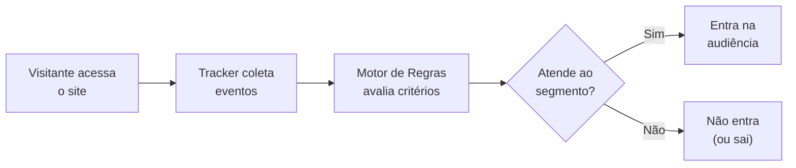
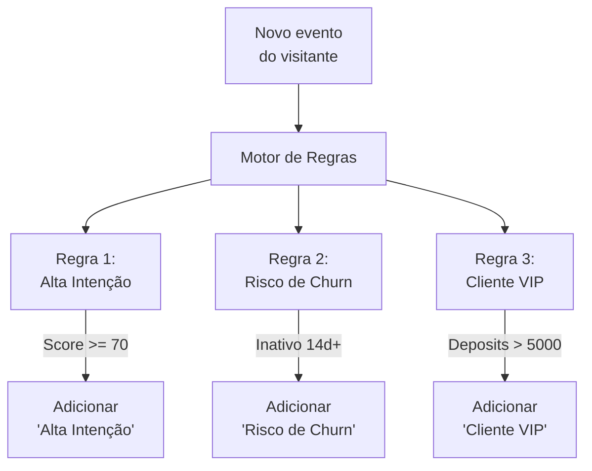
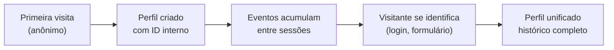

**Nesta página:**

- [O que é Audiência](#o-que-é-audiência)
- [Painel de Audiência](#painel-de-audiência)
- [Segmentos: os blocos da sua audiência](#segmentos-os-blocos-da-sua-audiência)
- [Criando um segmento](#criando-um-segmento)
- [Tipos de critérios](#tipos-de-critérios)
- [Dinâmico vs estático](#dinâmico-vs-estático)
- [Combinando segmentos](#combinando-segmentos)
- [Gerenciando segmentos](#gerenciando-segmentos)
- [Construtor de Segmentos](#construtor-de-segmentos)
- [Parametrização de Audiência](#parametrização-de-audiência)
- [Tipos de regras](#tipos-de-regras)
- [Configuração de intenção](#configuração-de-intenção)
- [Configuração de depósito](#configuração-de-depósito)
- [Anatomia de uma regra](#anatomia-de-uma-regra)
- [Criando uma regra passo a passo](#criando-uma-regra-passo-a-passo)
- [Prioridade entre regras](#prioridade-entre-regras)
- [Relatório de Usuários](#relatório-de-usuários)
- [Perfil unificado](#perfil-unificado)
- [Dados que compõem o perfil](#dados-que-compõem-o-perfil)
- [Filtros e busca avançada](#filtros-e-busca-avançada)
- [Timeline de atividade](#timeline-de-atividade)
- [Onde audiências são usadas](#onde-audiências-são-usadas)
- [Boas práticas](#boas-práticas)

---

## O que é Audiência

Audiência é a **central de segmentação** da UserIn. Nela você cria segmentos, configura regras automáticas de classificação e analisa perfis individuais de visitantes, tudo em um único lugar.

A plataforma avalia continuamente cada visitante em tempo real. Quando alguém navega pelo seu site, o motor de regras verifica os critérios configurados e adiciona ou remove segmentos automaticamente.



A tela de Audiência é organizada em três áreas:

<CardGroup cols={3}>
  <Card title="Segmentos" icon="layer-group">
    Crie e gerencie os grupos que formam sua audiência. Defina critérios e acompanhe o tamanho de cada segmento.
  </Card>
  <Card title="Parametrização" icon="sliders">
    Configure regras automáticas que classificam visitantes em segmentos com base em comportamento e intenção.
  </Card>
  <Card title="Relatório de Usuários" icon="users">
    Visualize perfis individuais, pesquise visitantes e analise a timeline completa de cada pessoa.
  </Card>
</CardGroup>

<div className="callout-blue">
  Audiências são **reativas**. Você não precisa atualizar listas manualmente. A plataforma reavalia cada visitante a cada novo evento, mantendo tudo sempre atualizado.
</div>

---

## Painel de Audiência

O Painel é a primeira tela ao acessar Audiência no menu lateral. Ele consolida indicadores, funis e gráficos que ajudam a entender o estado atual da base de visitantes sem precisar abrir relatórios individuais.

### Indicadores principais (KPIs)

Cinco cards no topo apresentam as métricas do período selecionado, cada um com variação percentual em relação ao período anterior:

| KPI | O que mostra |
|-----|-------------|
| **Total de Usuários** | Quantidade total de visitantes na base |
| **Novos FTD** | Visitantes que realizaram a primeira conversão no período |
| **Receita do Período** | Valor total de depósitos no período (R$) |
| **Taxa de Conversão** | Percentual de registrados que converteram no período |
| **Churn do Período** | Visitantes que se tornaram inativos no período |

Use o **seletor de período** no topo para alternar entre visualização **semanal** e **mensal**. Navegue entre períodos com as setas ou selecione diretamente no dropdown, que lista os últimos 12 períodos disponíveis.

### Funil de estágios

O funil mostra a progressão dos visitantes pelos quatro estágios do ciclo de vida:

| Estágio | Sigla | Descrição |
|---------|-------|-----------|
| **Anônimo** | - | Visitante navegando sem identificação |
| **Registrado** | - | Visitante que se cadastrou (identificado) |
| **FTD** | First Time Deposit | Visitante que realizou a primeira conversão |
| **MTD** | Multi Time Deposit | Visitante com conversões recorrentes |

Entre cada estágio, o funil exibe a **taxa de conversão** (cadastro, FTD, retorno) e a **receita** gerada nos estágios com depósito.

### Gráficos e análises

<Tabs>
  <Tab title="Evolução Temporal">
    Gráfico de linhas com evolução **semanal ou mensal** de três métricas: usuários, FTDs e receita.

    O painel inclui um resumo com valor do período atual, média das últimas 12 semanas/meses e indicador de tendência (alta, queda ou estável).
  </Tab>

  <Tab title="Segmentos mais aplicados">
    Lista os 8 segmentos com mais visitantes associados. Cada item mostra a contagem absoluta e o percentual em relação ao total da base.

    Use para identificar quais segmentos concentram a maior parte da audiência e quais estão sub-representados.
  </Tab>

  <Tab title="Cohorts de Retenção">
    Mapa de calor que mostra a retenção de visitantes ao longo de semanas consecutivas.

    | Tipo de cohort | O que mede |
    |----------------|-----------|
    | Registro → FTD | Tempo entre o cadastro e a primeira conversão |
    | FTD → Depósito | Tempo entre a primeira e as próximas conversões |

    A legenda indica: **alta conversão** (≥ 30%, verde), **baixa** (< 15%, vermelho) e **não disponível** (cinza).
  </Tab>

  <Tab title="Performance de UTMs">
    Analisa o desempenho dos parâmetros UTM que trouxeram visitantes ao site.

    Agrupável por **Source**, **Medium** ou **Campaign**. Para cada valor de UTM, a tabela exibe: registros, FTDs, taxa de conversão e receita gerada.

    Conversão é classificada como **boa** (≥ 30%), **média** (15-30%) ou **baixa** (< 15%).
  </Tab>

  <Tab title="Distribuição por Tier">
    Mostra como os visitantes com depósitos estão distribuídos entre os tiers de valor:

    | Tier | Descrição |
    |------|-----------|
    | **Whale** | Valor muito alto |
    | **High** | Alto valor |
    | **Medium** | Valor médio |
    | **Low** | Valor básico |

    Cada tier exibe a quantidade de usuários, receita acumulada e uma barra de progresso proporcional.
  </Tab>
</Tabs>

<Tip>
  Comece cada análise pelo funil de estágios. Se a taxa de conversão entre "Registrado" e "FTD" estiver baixa, concentre suas jornadas nesse ponto. Se a retenção pós-FTD cair nas cohorts, priorize jornadas de reativação.
</Tip>

---

## Segmentos: os blocos da sua audiência

Segmentos são **rótulos dinâmicos** aplicados a visitantes com base em regras que você define. Cada segmento representa um grupo com uma característica em comum.

| Segmento | Critério | Audiência resultante |
|----------|----------|----------------------|
| Novos visitantes | Primeira sessão no site | Visitantes que acabaram de chegar |
| Alta intenção | Score de intenção acima de 70 | Visitantes prontos para converter |
| Carrinho abandonado | Adicionou item mas não finalizou | Visitantes com compra incompleta |
| Engajados | 3+ sessões por semana | Visitantes recorrentes e ativos |
| Risco de churn | Sem acesso há 14+ dias | Visitantes que estão se afastando |

Um visitante pode pertencer a **múltiplos segmentos** simultaneamente. Exemplo: estar nos segmentos "Engajado", "Alta Intenção" e "Cliente Ativo" ao mesmo tempo.

<Tip>
  Pense em segmentos como **etiquetas inteligentes**. Eles são aplicados e removidos automaticamente conforme o visitante muda de comportamento.
</Tip>

---

## Criando um segmento

<Steps>
  <Step title="Acesse a seção Audiência">
    No menu lateral da plataforma, clique em **Audiência**. Você verá a lista de segmentos existentes com a contagem de visitantes em cada um.
  </Step>

  <Step title="Clique em Criar Segmento">
    O formulário de criação abre com campos para nome, descrição e critérios.
  </Step>

  <Step title="Defina o nome e a descrição">
    Escolha um nome descritivo que identifique claramente o grupo:

    - "Alta Intenção - Score 70+"
    - "Inativos 30 dias"
    - "Compradores Recorrentes"
  </Step>

  <Step title="Configure os critérios">
    Adicione uma ou mais condições. Cada condição é composta por **campo + operador + valor**.

    ```
    intention.score >= 70
    ```

    Combine múltiplas condições com lógica **E** (todas verdadeiras) ou **OU** (pelo menos uma).
  </Step>

  <Step title="Valide a audiência estimada">
    A plataforma mostra uma **estimativa de visitantes** que atendem aos critérios. Use isso para validar se o segmento não está amplo nem restrito demais.
  </Step>

  <Step title="Salve e ative">
    Ao salvar, o segmento começa a ser avaliado imediatamente. Visitantes que já atendem aos critérios são adicionados em tempo real.
  </Step>
</Steps>

---

## Tipos de critérios

Os critérios definem **quais visitantes** entram no segmento. A UserIn oferece quatro categorias que podem ser combinadas livremente.

<Tabs>
  <Tab title="Comportamentais">
    Critérios baseados em **ações e padrões de navegação**.

    | Critério | Exemplo |
    |----------|---------|
    | Páginas visitadas | Visitou `/pricing` nos últimos 7 dias |
    | Frequência de visitas | 3+ sessões por semana |
    | Tempo no site | Média de 5+ minutos por sessão |
    | Scroll depth | Atingiu 75%+ em páginas-chave |
    | Cliques | Clicou no botão "Falar com vendas" |
    | Eventos customizados | Disparou evento `add_to_cart` |

    Critérios comportamentais são os mais dinâmicos: mudam a cada sessão do visitante.
  </Tab>

  <Tab title="Atributos do Perfil">
    Critérios baseados em **dados do perfil**, coletados via tracker, API ou formulários.

    | Critério | Exemplo |
    |----------|---------|
    | Email | `contact.email` existe (visitante identificado) |
    | Plano | `plan = enterprise` |
    | Cidade | `contact.city = São Paulo` |
    | Dispositivo | `device.type = mobile` |
    | Campo customizado | Qualquer campo da Ontologia |

    Atributos permitem segmentar por **quem o visitante é**, não apenas pelo que faz.
  </Tab>

  <Tab title="Financeiros">
    Critérios baseados em **dados transacionais**.

    | Critério | Exemplo |
    |----------|---------|
    | Total gasto | `deposits.total > 1000` |
    | Quantidade de compras | `deposits.count >= 5` |
    | Ticket médio | `deposits.average > 200` |
    | Tier/classificação | `deposits.tier = high` |
    | Primeira compra | `deposits.ftd.amount > 0` |

    Combine critérios financeiros com comportamentais para encontrar clientes de alto valor com frequência de acesso declinante.
  </Tab>

  <Tab title="Intenção e Sinais">
    Critérios baseados em **métricas computadas** pela plataforma.

    | Critério | Exemplo |
    |----------|---------|
    | Score de intenção | `intention.score >= 70` |
    | Nível de intenção | `intention.level = high` |
    | Lead score | `signals.leadScore > 80` |
    | Sinais customizados | Qualquer sinal configurado na Ontologia |

    Sinais agregam múltiplos fatores em uma única métrica. Ideais para segmentações que dependem de análises mais sofisticadas.
  </Tab>
</Tabs>

---

## Dinâmico vs estático

A UserIn trabalha com dois modelos de segmento:

<CardGroup cols={2}>
  <Card title="Segmentos Dinâmicos" icon="arrows-spin">
    Avaliados **continuamente** a cada novo evento. Visitantes entram e saem automaticamente conforme mudam de comportamento.

    **Exemplo:** segmento "Alta Intenção" com critério `intention.score >= 70`. Quando o score sobe para 72, o visitante entra. Se cai para 65, sai.

    **Quando usar:** para a maioria dos casos. Audiências que precisam estar sempre atualizadas.
  </Card>
  <Card title="Segmentos Estáticos" icon="lock">
    Adicionados **manualmente** ou por ação de jornada. O visitante permanece até ser removido explicitamente.

    **Exemplo:** segmento "Participou Campanha Black Friday" adicionado via jornada quando o visitante interagiu com a campanha.

    **Quando usar:** para marcar eventos pontuais, histórico de campanhas ou classificações que não devem mudar automaticamente.
  </Card>
</CardGroup>

<div className="callout-blue">
  Segmentos **estáticos** são gerenciados via ações de jornada (blocos "Adicionar Segmento" e "Remover Segmento" no Construtor de Fluxos) ou via API. Segmentos **dinâmicos** são gerenciados automaticamente pela plataforma.
</div>

---

## Combinando segmentos

Para criar audiências mais refinadas, combine múltiplos critérios com operadores lógicos.

### Operador E (AND)

O visitante deve atender a **todos** os critérios. Quanto mais condições com E, mais restrita a audiência.

```
intention.score >= 70
E deposits.count = 0
E behavior.sessionsPerWeek >= 2
```

Resultado: visitantes com alta intenção que ainda não compraram e acessam o site com frequência. Audiência ideal para uma oferta de primeira conversão.

### Operador OU (OR)

O visitante deve atender a **pelo menos um** dos critérios. Quanto mais condições com OU, mais ampla a audiência.

```
deposits.tier = high
OU behavior.sessionsPerWeek >= 5
```

Resultado: visitantes de alto valor financeiro OU com engajamento muito alto. Audiência para programa de fidelidade.

### Combinação mista

```
(intention.level = high OU deposits.tier = high)
E contact.email existe
E segmento != "Cliente Ativo"
```

Resultado: visitantes de alto potencial (por intenção OU valor), identificados (têm email) e que ainda não são clientes.

---

## Gerenciando segmentos

A tela de gestão lista todos os segmentos cadastrados na plataforma. No topo, quatro cards resumem o estado geral:

| Indicador | O que mostra |
|-----------|-------------|
| **Total de Segmentos** | Quantidade total cadastrada |
| **Segmentos Ativos** | Quantos estão habilitados e sendo avaliados |
| **Categorias** | Quantas categorias diferentes estão em uso |
| **Sincronizados** | Quantos segmentos estão sendo enviados para integrações externas |

### Filtros da listagem

A lista suporta três tipos de filtro combináveis:

| Filtro | Opções |
|--------|--------|
| **Busca por texto** | Pesquisa por nome técnico ou nome de exibição |
| **Sincronização** | Todos, Sincronizados, Não sincronizados |
| **Categoria** | Filtra por categoria com contagem de segmentos em cada uma |

### Formulário de segmento

Ao clicar em **Criar Segmento**, o formulário apresenta os seguintes campos:

| Campo | Obrigatório | Descrição |
|-------|-------------|-----------|
| **Nome Técnico** | Sim | Identificador interno usado pelo motor de regras (ex: `high_value_user`) |
| **Nome de Exibição** | Sim | Nome legível exibido na interface e relatórios (ex: "Usuário de Alto Valor") |
| **Descrição** | Não | Texto livre para documentar o propósito do segmento |
| **Cor** | Não | Cor de identificação visual (10 opções disponíveis) |
| **Categoria** | Não | Classificação do segmento para organização |
| **Prioridade** | Não | Número que define a ordem de avaliação (menor = mais prioritário) |
| **Ativa** | Sim | Liga ou desliga a avaliação do segmento |
| **Sincronizar com Integrações** | Não | Quando ativado, o segmento é enviado para plataformas integradas (CRMs) |

### Categorias de segmentos

Segmentos são organizados em sete categorias para facilitar a gestão:

| Categoria | Uso típico |
|-----------|-----------|
| **Intenção** | Segmentos baseados em score e nível de intenção |
| **Financeiro** | Segmentos baseados em valor, tier e depósitos |
| **Risco** | Segmentos de churn, declínio e inatividade |
| **Preferências** | Segmentos baseados em interesses e categorias de conteúdo |
| **Comportamento** | Segmentos baseados em frequência, engajamento e ações |
| **Lifecycle** | Segmentos de estágio no ciclo de vida (novo, primeiro depósito, recorrente) |
| **Geral** | Segmentos que não se encaixam nas categorias acima |

A plataforma sugere automaticamente a categoria com base nas palavras-chave do nome técnico.

### Condições do segmento

Cada segmento é definido por um conjunto de **condições** organizadas em grupos:

- Dentro de um grupo, as condições se combinam com lógica **E** (todas devem ser verdadeiras)
- Entre grupos, a lógica é **OU** (pelo menos um grupo deve ser verdadeiro)

Cada condição é composta por: **campo** (selecionado via picker de campos da Ontologia), **operador** e **valor**.

Operadores disponíveis:

| Operador | Símbolo | Descrição |
|----------|---------|-----------|
| Igual | `=` | Valor exato |
| Diferente | `≠` | Qualquer valor exceto o especificado |
| Maior que | `>` | Acima do valor |
| Maior ou igual | `≥` | Acima ou igual ao valor |
| Menor que | `<` | Abaixo do valor |
| Menor ou igual | `≤` | Abaixo ou igual ao valor |
| Está em | `∈` | Valor está na lista |
| Não está em | `∉` | Valor não está na lista |
| Contém | `⊃` | Texto contém a substring |
| Existe | `∃` | Campo tem algum valor (não está vazio) |

<div className="callout-blue">
  O picker de campos exibe todos os campos configurados na Ontologia, incluindo campos customizados. Isso permite criar segmentos com critérios específicos do seu negócio, além dos campos padrão da plataforma.
</div>

### Sincronização com integrações

Quando a opção **Sincronizar com Integrações** está ativada, o segmento é enviado automaticamente para plataformas conectadas (ex: CRMs). Isso permite que sistemas externos usem os mesmos segmentos da UserIn para personalizar comunicações.

O filtro de sincronização na listagem ajuda a identificar rapidamente quais segmentos estão sendo compartilhados.

### Segmentos padrão

A plataforma inclui segmentos pré-configurados, identificados pelo badge **UserIn**. Esses segmentos são criados automaticamente e cobrem cenários comuns de classificação.

Segmentos padrão têm o nome técnico protegido (não editável), mas você pode ajustar condições, cor, prioridade e demais configurações. O botão **Resetar para Padrão** restaura as configurações originais caso você precise reverter alterações.

---

## Construtor de Segmentos

Para segmentos com critérios mais complexos, a plataforma oferece o **Construtor de Segmentos**: um editor visual com arrastar e soltar que permite montar regras compostas.

### Elementos do construtor

| Elemento | Descrição |
|----------|-----------|
| **Detalhes do Segmento** | Nome e descrição do segmento |
| **Biblioteca de Condições** | Painel lateral com condições predefinidas para arrastar |
| **Área de Construção** | Canvas central onde as condições são montadas |
| **Estimativa de Audiência** | Card que mostra quantos visitantes atendem aos critérios (total, identificados e anônimos) |
| **Insights** | Indicadores de crescimento, precisão e tendência do segmento |

### Biblioteca de condições

A biblioteca oferece templates prontos organizados por categoria:

| Categoria | Condições disponíveis |
|-----------|----------------------|
| **Dados do Usuário** | Atributo do Usuário |
| **Comportamento** | Condição de Página, Condição de Formulário, Contagem de Eventos, Tempo Desde Evento |
| **Mensagens** | Condição de Email |
| **Dispositivo** | Condição de Dispositivo |

Arraste uma condição da biblioteca para a área de construção e configure os parâmetros (campo, operador e valor).

### Gerador de Segmentos com IA

Assim como nas jornadas, a Audiência oferece um gerador por inteligência artificial. Descreva o segmento em linguagem natural e a IA monta as condições automaticamente.

<Steps>
  <Step title="Clique em Gerar com IA">
    No topo do Construtor de Segmentos, clique no botão de geração por IA.
  </Step>
  <Step title="Descreva o segmento">
    Escreva o que o segmento deve representar. Seja específico sobre critérios, valores e períodos.
  </Step>
  <Step title="Revise e ajuste">
    A IA gera as condições automaticamente. Revise cada condição no canvas e ajuste valores ou operadores conforme necessário.
  </Step>
</Steps>

**Exemplos de prompts que funcionam bem:**

| Prompt | Resultado |
|--------|-----------|
| "Usuários que visitaram a página de preços nos últimos 30 dias mas não compraram" | Condição de página + condição de evento + operador temporal |
| "Clientes de alto valor com mais de 5 compras" | Condição de atributo financeiro + contagem |
| "Visitantes mobile que fizeram login na última semana" | Condição de dispositivo + condição de evento + período |

### Segmentos prontos

A aba **Segmentos Prontos** oferece templates completos que você pode aplicar com um clique:

| Segmento | Critérios incluídos |
|----------|-------------------|
| **Clientes Alto Valor** | Atributos financeiros + histórico de compras + status |
| **Mobile Engajados** | Dispositivo mobile + páginas visitadas + login recente |
| **Carrinho Abandonado** | Adicionou ao carrinho + não finalizou compra + visitou a página |
| **Engajados Email** | Abriu emails + clicou em links + consentimento ativo |

### Importar e exportar

O Construtor suporta importação e exportação de regras em formato JSON. Isso permite compartilhar configurações entre ambientes, versionar regras em sistemas de controle ou restaurar configurações anteriores.

O modal de importação oferece três modos: **Gerar com IA**, **Exemplos** (templates prontos em JSON) e **JSON Manual** (cole ou carregue um arquivo).

<Tip>
  Use a estimativa de audiência como guia. Se o número de visitantes é zero, os critérios provavelmente estão restritivos demais. Se é igual ao total da base, os critérios estão muito amplos. Ajuste até encontrar o equilíbrio para o objetivo da sua segmentação.
</Tip>

---

## Parametrização de Audiência

A Parametrização é onde você configura **regras automáticas** que classificam visitantes em segmentos. Em vez de criar segmentos por critérios simples, as regras avaliam padrões complexos e aplicam segmentos automaticamente.

O motor de regras analisa continuamente cada visitante e decide em quais segmentos ele deve estar.



Múltiplas regras podem ser avaliadas e executadas para o mesmo visitante no mesmo momento.

---

## Tipos de regras

<Tabs>
  <Tab title="Regras de Intenção">
    Classificam visitantes com base em **padrões de navegação e engajamento**.

    | Critério | O que avalia | Exemplo |
    |----------|--------------|---------|
    | Score de intenção | Probabilidade de conversão (0-100) | `intention.score >= 70` |
    | Nível de intenção | Classificação categórica | `intention.level = high` |
    | Frequência de visitas | Sessões por período | `sessions.lastWeek >= 3` |
    | Profundidade de navegação | Páginas por sessão | `pages.perSession >= 5` |
    | Tempo no site | Duração média das sessões | `session.avgDuration >= 300` |
    | Páginas visitadas | URLs específicas | Visitou `/pricing` + `/features` |

    **Quando usar:** para identificar visitantes próximos de converter ou engajados com conteúdo estratégico.

    <Tip>
      Regras de intenção são ideais para acionar jornadas de **conversão**. Um visitante que visita a página de preços 3 vezes em uma semana está sinalizando interesse claro.
    </Tip>
  </Tab>

  <Tab title="Regras de Comportamento">
    Classificam visitantes com base em **ações transacionais e histórico**.

    | Critério | O que avalia | Exemplo |
    |----------|--------------|---------|
    | Total gasto | Valor acumulado | `deposits.total > 1000` |
    | Quantidade de compras | Número de transações | `deposits.count >= 5` |
    | Tier/classificação | Faixa de valor | `deposits.tier = high` |
    | Última atividade | Dias desde o último evento | `lastActivity.daysAgo > 14` |
    | Estágio | Fase no funil | `stage = ftd` |
    | Eventos específicos | Ações customizadas | Disparou `purchase_complete` |

    **Quando usar:** para identificar clientes de alto valor, visitantes inativos ou padrões de compra.
  </Tab>
</Tabs>

---

### Configuração de intenção

A aba de **Intenção** na Parametrização permite ajustar como a plataforma calcula o score de intenção de cada visitante. A configuração é dividida em três áreas.

#### Thresholds de classificação

Definem os limites para classificar visitantes por nível de intenção:

| Nível | Condição | Padrão |
|-------|----------|--------|
| **Alto** | Score maior ou igual ao threshold | ≥ 70 |
| **Médio** | Score entre o threshold médio e o alto | ≥ 40 e < 70 |
| **Baixo** | Score abaixo do threshold médio | < 40 |

#### Pesos por estágio

O score de intenção é calculado como uma **média ponderada** de fatores comportamentais. Cada fator recebe um peso, e os pesos devem somar 100 por estágio.

| Fator | O que avalia |
|-------|-------------|
| **Duração da Sessão** | Tempo médio de permanência por sessão |
| **Páginas Visitadas** | Total de páginas visualizadas |
| **Páginas Únicas** | Quantidade de páginas diferentes acessadas |
| **Conteúdos Visualizados** | Páginas de conteúdo específico visitadas |
| **Visitou Página de Conversão** | Se acessou páginas-chave configuradas |
| **Sessões após FTD** | Frequência de retorno após a primeira conversão |
| **Frequência de Depósito** | Regularidade de conversões |
| **Valor Médio de Depósito** | Ticket médio das conversões |
| **Recência** | Tempo desde a última atividade |

Os pesos são configurados **por estágio** (Anônimo, Registrado, FTD, MTD), pois a importância de cada fator muda conforme o visitante avança no funil.

#### Benchmarks

Para cada estágio, configure os valores de referência que definem o que é considerado "bom" para cada fator:

| Benchmark | Exemplo |
|-----------|---------|
| **Duração boa (min)** | 5 minutos |
| **Páginas boas** | 8 páginas |
| **Páginas únicas boas** | 5 páginas |
| **Conteúdos bons** | 3 conteúdos |
| **Recência máxima (dias)** | 7 dias |
| **Depósitos/mês mínimos** | 2 depósitos |

#### Páginas de conversão

Para cada estágio, defina as URLs que representam **intenção de conversão**. Quando o visitante acessa uma dessas páginas, o fator "Visitou Página de Conversão" é ativado.

Exemplo: `/register` para anônimos, `/deposit` para registrados.

<div className="callout-blue">
  Os pesos devem somar exatamente 100 por estágio. Priorize os fatores que melhor indicam intenção no contexto do seu produto. Para visitantes anônimos, foque em navegação (duração, páginas). Para FTDs, foque em frequência e valor de depósito.
</div>

---

### Configuração de depósito

A aba de **Depósito** na Parametrização configura a classificação financeira dos visitantes. Ela define tiers, alertas, metas e análise de tendência.

#### Tiers de depósito

Faixas de valor que classificam visitantes por volume de depósitos:

| Tier | Faixa padrão |
|------|-------------|
| **Low** | R$ 0 a R$ 100 |
| **Medium** | R$ 100 a R$ 500 |
| **High** | R$ 500 a R$ 2.000 |
| **Whale** | R$ 2.000+ |

Os valores mínimo e máximo de cada tier são editáveis. Ajuste conforme o ticket médio do seu produto.

#### Alertas de inatividade

Definem quando o sistema sinaliza visitantes inativos:

| Alerta | O que monitora | Padrão |
|--------|---------------|--------|
| **Alerta Amarelo** | Dias sem atividade para alerta inicial | 7 dias |
| **Alerta Vermelho** | Dias sem atividade para alerta crítico | 14 dias |
| **Saldo Baixo** | Threshold de saldo para sinalização | R$ 50 |

Esses alertas alimentam segmentos automáticos de risco e podem ser usados como critério em jornadas.

#### Metas de depósito

Valores-alvo que a plataforma usa para avaliar a saúde financeira da base:

| Meta | O que define | Padrão |
|------|-------------|--------|
| **Meta Semanal** | Receita esperada por semana | R$ 500 |
| **Meta Mensal** | Receita esperada por mês | R$ 2.000 |
| **Ticket Médio Ideal** | Valor médio esperado por depósito | R$ 100 |

Metas são usadas para calcular os indicadores de performance no Painel de Audiência.

#### LTV (Lifetime Value)

Thresholds para classificar o valor vitalício dos visitantes:

| Classificação | Threshold padrão |
|---------------|-----------------|
| **LTV Baixo** | Até R$ 1.000 |
| **LTV Médio** | R$ 1.000 a R$ 5.000 |
| **LTV Alto** | Acima de R$ 20.000 |

#### Análise de tendência

Configuração do algoritmo que identifica se o comportamento de depósito do visitante está **subindo**, **caindo** ou **estável**:

| Parâmetro | O que define | Padrão |
|-----------|-------------|--------|
| **Período de Análise** | Janela temporal para calcular tendência | 4 semanas |
| **Threshold de Aumento** | Variação mínima para classificar como tendência de alta | 20% |
| **Threshold de Queda** | Variação mínima para classificar como tendência de queda | 20% |

<Tip>
  Revise os tiers de depósito e metas trimestralmente. À medida que a base de visitantes cresce e o perfil muda, os valores padrão podem se tornar inadequados. Use o Painel de Audiência para validar se a distribuição por tier está equilibrada.
</Tip>

---

## Anatomia de uma regra

Toda regra segue a mesma estrutura: **condição + ação**.

### Condição

Composta por três elementos:

| Elemento | Descrição | Exemplo |
|----------|-----------|---------|
| **Campo** | Qual dado do visitante avaliar | `intention.score` |
| **Operador** | Tipo de comparação | `>=` (maior ou igual) |
| **Valor** | Referência para a comparação | `70` |

Operadores disponíveis:

| Operador | Descrição | Uso |
|----------|-----------|-----|
| `=` | Igual a | Valores exatos |
| `!=` | Diferente de | Exclusão |
| `>` / `>=` | Maior (ou igual) | Thresholds numéricos |
| `<` / `<=` | Menor (ou igual) | Limites superiores |
| `contém` | Texto contém substring | Buscas parciais |
| `existe` | Campo tem valor | Verificar preenchimento |
| `não existe` | Campo está vazio | Identificar lacunas |

Condições podem ser **compostas**:

```
intention.score >= 70
E deposits.count = 0
E lastActivity.daysAgo <= 7
```

### Ação

Define o que acontece quando a condição é verdadeira:

<CardGroup cols={2}>
  <Card title="Adicionar Segmento" icon="circle-plus">
    Inclui o visitante em um segmento quando a condição é atendida.
  </Card>
  <Card title="Remover Segmento" icon="circle-minus">
    Remove o visitante de um segmento quando a condição deixa de ser atendida.
  </Card>
</CardGroup>

A combinação de adicionar e remover cria **ciclos automáticos**. Quando o score sobe para 70, adiciona "Alta Intenção". Quando cai abaixo de 70, remove. O visitante entra e sai conforme seu comportamento muda.

---

## Criando uma regra passo a passo

<Steps>
  <Step title="Acesse Parametrização de Audiência">
    Dentro da seção **Audiência**, acesse a aba de **Parametrização**. Você verá a lista de regras com status (ativa/inativa) e visitantes impactados.
  </Step>

  <Step title="Clique em Criar Regra">
    Escolha o tipo: **Intenção** ou **Comportamento**. O tipo determina quais campos estarão disponíveis.
  </Step>

  <Step title="Nomeie a regra">
    Use um padrão descritivo: **[Tipo] - [Critério] - [Ação]**. Exemplos:

    - "Intenção - Score 70+ - Add Alta Intenção"
    - "Comportamento - Inativo 14d - Add Risco Churn"
  </Step>

  <Step title="Configure a condição">
    Selecione o **campo**, o **operador** e o **valor**:

    ```
    Campo: intention.score
    Operador: >=
    Valor: 70
    ```
  </Step>

  <Step title="Defina a ação e a prioridade">
    Escolha qual segmento adicionar/remover. Atribua um número de prioridade (regras com número mais alto prevalecem em caso de conflito).
  </Step>

  <Step title="Ative a regra">
    Ao ativar, o motor começa a avaliar para todos os visitantes. Quem já atende aos critérios recebe o segmento imediatamente.
  </Step>
</Steps>

---

## Prioridade entre regras

Quando múltiplas regras gerenciam o **mesmo segmento**, o sistema de prioridade resolve conflitos. Cada regra tem um número de prioridade: quanto maior, mais prioritária.

| Cenário | Regra A (prioridade 10) | Regra B (prioridade 5) | Resultado |
|---------|-------------------------|------------------------|-----------|
| Ambas adicionam | Adicionar "VIP" | Adicionar "VIP" | Adicionado (sem conflito) |
| Conflito | Adicionar "VIP" | Remover "VIP" | Adicionado (Regra A prevalece) |
| Conflito inverso | Remover "VIP" | Adicionar "VIP" | Removido (Regra A prevalece) |

Organize as prioridades em três faixas:

<AccordionGroup>
  <Accordion title="Alta (80-100): regras de proteção" icon="shield" defaultOpen>
    Protegem visitantes de segmentos incorretos. Exemplo: "Se é funcionário interno, remover de todos os segmentos de marketing".
  </Accordion>

  <Accordion title="Média (40-70): regras de negócio" icon="briefcase">
    Implementam a lógica principal. Exemplo: "Se score >= 70, adicionar Alta Intenção". A maioria fica aqui.
  </Accordion>

  <Accordion title="Baixa (1-30): regras de fallback" icon="arrow-down">
    Classificações genéricas quando nenhuma regra específica se aplica. Exemplo: "Se nenhum segmento ativo, adicionar Visitante Genérico".
  </Accordion>
</AccordionGroup>

<div className="callout-blue">
  Defina prioridades com espaçamento: 10, 20, 30 em vez de 1, 2, 3. Isso permite inserir novas regras entre as existentes sem reorganizar todas.
</div>

---

## Relatório de Usuários

O Relatório de Usuários é a **central de perfis** dentro da Audiência. Nele você visualiza todos os visitantes que interagiram com seu site, com dados unificados de comportamento, atributos, segmentos e histórico.

Cada linha do relatório representa um visitante único. Você pode pesquisar, filtrar por segmentos, ordenar por atributos e abrir o perfil individual para analisar a jornada completa.

### Colunas e ordenação

A tabela permite configurar quais colunas são exibidas e ordenar por qualquer uma delas:

| Coluna padrão | Descrição |
|---------------|-----------|
| ID / Nome | Identificador ou nome do visitante |
| Email | Endereço de email (se identificado) |
| Segmentos | Segmentos ativos do visitante |
| Última atividade | Data/hora do último evento registrado |
| Sessões | Total de sessões no site |
| Score de intenção | Score computado pela plataforma |

<Note>
  O relatório mostra visitantes **identificados e anônimos**. Visitantes anônimos aparecem com um ID interno até serem identificados via `userin.identify()`.
</Note>

---

## Perfil unificado

Todo visitante recebe um **perfil único** que persiste entre sessões. Quando um visitante anônimo se identifica, a UserIn mescla automaticamente todo o histórico prévio.



A unificação é automática e irreversível. Após a identificação, o perfil contém a jornada completa: desde a primeira visita anônima até o momento atual.

```javascript
userin.identify('user_123', {
  email: 'joao@empresa.com',
  name: 'João Silva'
});
```

<Tip>
  Identifique visitantes o mais cedo possível. Quanto antes a identificação, mais completo o perfil. Implemente `userin.identify()` em login, cadastro, formulários e checkout.
</Tip>

---

## Dados que compõem o perfil

Cada perfil agrega cinco categorias de dados:

<Tabs>
  <Tab title="Atributos">
    Dados descritivos coletados via tracker, API ou formulários.

    | Atributo | Origem | Exemplo |
    |----------|--------|---------|
    | Nome | `userin.identify()` | João Silva |
    | Email | `userin.identify()` ou formulário | joao@empresa.com |
    | Telefone | API ou formulário | +55 11 99999-0000 |
    | Plano | API backend | Enterprise |
    | Cidade | Geolocalização automática | São Paulo |
    | Dispositivo | Tracker automático | Desktop / Chrome |
    | Campos customizados | Ontologia | Qualquer campo criado por você |
  </Tab>

  <Tab title="Eventos">
    Registro cronológico de **todas as ações** no site.

    | Evento | Descrição |
    |--------|-----------|
    | `page_view` | Página visitada (URL, título, referrer) |
    | `click` | Interação com elementos da página |
    | `form_submit` | Envio de formulário |
    | `scroll_depth` | Profundidade de leitura (25%, 50%, 75%, 100%) |
    | `session` | Início e fim de sessão |
    | Eventos customizados | Via `userin.track()` |

    Eventos são imutáveis: uma vez registrados, permanecem no histórico.
  </Tab>

  <Tab title="Segmentos">
    Lista de todos os **segmentos** ativos do visitante.

    O perfil mostra segmentos ativos (dinâmicos e estáticos), data de entrada em cada um e histórico de entradas e saídas.
  </Tab>

  <Tab title="Sinais">
    **Métricas computadas** pela plataforma com base no comportamento.

    | Sinal | Descrição | Exemplo |
    |-------|-----------|---------|
    | Score de intenção | Probabilidade de conversão (0-100) | 78 |
    | Nível de intenção | Classificação categórica | high |
    | Sessões por semana | Frequência média de acesso | 3.2 |
    | Total de sessões | Número acumulado de visitas | 42 |
    | Sinais customizados | Configurados na Ontologia | lead_score: 85 |
  </Tab>

  <Tab title="Jornadas">
    Histórico de **automações** que o visitante percorreu.

    Registra quais jornadas o visitante entrou, em qual bloco está atualmente, quais componentes foram exibidos e quais conversões foram rastreadas.
  </Tab>
</Tabs>

---

## Filtros e busca avançada

O relatório oferece mecanismos de filtragem para encontrar visitantes específicos ou grupos.

<AccordionGroup>
  <Accordion title="Busca por texto" icon="magnifying-glass" defaultOpen>
    Digite no campo de busca para encontrar visitantes por **nome, email ou ID externo**. A busca é instantânea e filtra a tabela em tempo real.
  </Accordion>

  <Accordion title="Filtro por segmento" icon="users-viewfinder">
    Selecione um ou mais segmentos para exibir apenas visitantes que pertencem a eles. Combine segmentos com lógica **E** (pertencem a todos) ou **OU** (pertencem a pelo menos um).
  </Accordion>

  <Accordion title="Filtro por atributo" icon="sliders">
    Crie filtros com atributos específicos do perfil:

    - `deposits.total > 500` (gastaram mais de R\$ 500)
    - `contact.email existe` (apenas identificados)
    - `intention.level = high` (alta intenção)

    Combinável com filtros por segmento para criar visualizações precisas.
  </Accordion>

  <Accordion title="Filtro por período" icon="calendar">
    Restrinja a visitantes com atividade em um período específico: últimas 24h, 7 dias, 30 dias ou período customizado.
  </Accordion>
</AccordionGroup>

<div className="callout-blue">
  Filtros são **cumulativos**. Cada filtro adicional refina a visualização. Exemplo: "segmento 'Alta Intenção' + email cadastrado + atividade nos últimos 7 dias".
</div>

---

## Timeline de atividade

Ao abrir o perfil de um visitante, a aba **Timeline** mostra o registro cronológico completo, do evento mais recente ao mais antigo.

| Tipo de registro | Exemplo |
|------------------|---------|
| Páginas visitadas | Acessou `/pricing` em 25/02 às 14:32 |
| Eventos | Disparou `add_to_cart` com valor R\$ 150 |
| Segmentos | Entrou no segmento "Alta Intenção" |
| Jornadas | Entrou na jornada "Conversão - Modal Oferta" |
| Componentes | Visualizou modal "Oferta 20% Desconto" |
| Identificação | Identificado como `user_123` (joao@empresa.com) |
| Conversões | Conversão rastreada: R\$ 300 |

<Tip>
  A timeline é a melhor ferramenta para **debugar jornadas**. Se um visitante não está vendo um componente esperado, abra a timeline e verifique: ele entrou na jornada? Atendeu às condições? Qual bloco foi executado?
</Tip>

---

## Onde audiências são usadas

Segmentos alimentam diversas partes da plataforma. Depois de criar um segmento, você pode usá-lo em:

<AccordionGroup>
  <Accordion title="Construtor de Fluxos" icon="route" defaultOpen>
    Segmentos funcionam como **gatilhos** e **condições** nas jornadas:

    - **Gatilho**: iniciar um fluxo quando o visitante entra em um segmento
    - **Condição**: verificar pertencimento antes de executar uma ação
    - **Ação**: adicionar ou remover segmentos como resultado da jornada
  </Accordion>

  <Accordion title="Componentes" icon="puzzle-piece">
    Segmentos definem **quem vê** cada componente visual:

    - Modal apenas para "Alta Intenção"
    - Smart block personalizado para "Clientes VIP"
    - Mini game para "Novos Visitantes"
  </Accordion>

  <Accordion title="Insights AI" icon="lightbulb">
    A inteligência artificial analisa segmentos e gera **diagnósticos e oportunidades** automaticamente. Quanto mais segmentos bem definidos, mais relevantes os insights.
  </Accordion>
</AccordionGroup>

---

## Boas práticas

<AccordionGroup>
  <Accordion title="Crie segmentos com propósito claro" icon="bullseye" defaultOpen>
    Cada segmento deve ter um **objetivo definido**. Se não há jornada, componente ou análise associada, o segmento provavelmente é desnecessário.

    Bons exemplos: "Alta intenção sem conversão" (objetivo: oferta), "Inativos 30d" (objetivo: reativação).
  </Accordion>

  <Accordion title="Comece com poucas regras e expanda" icon="seedling">
    Um conjunto pequeno de regras bem calibradas é mais eficaz do que dezenas mal configuradas. Comece com 3 a 5 regras essenciais e adicione conforme a necessidade de negócio surgir.
  </Accordion>

  <Accordion title="Configure sempre a ação inversa nas regras" icon="arrows-rotate">
    Se uma regra adiciona o segmento "Alta Intenção" quando o score é >= 70, configure também a remoção quando o score cair abaixo. Sem a ação inversa, visitantes que perdem a qualificação continuam no segmento indefinidamente.
  </Accordion>

  <Accordion title="Mantenha a nomenclatura organizada" icon="folder-open">
    Use um padrão: **[Estágio] - [Critério]** para segmentos e **[Tipo] - [Critério] - [Ação]** para regras. Facilita a busca quando a lista cresce.
  </Accordion>

  <Accordion title="Use a timeline para debug" icon="bug">
    Se uma jornada ou componente não funciona como esperado, abra a timeline de um visitante afetado. Verifique eventos, segmentos e jornadas para encontrar onde a lógica falhou.
  </Accordion>

  <Accordion title="Revise thresholds periodicamente" icon="chart-line">
    Comportamento de audiência muda ao longo do tempo. Um score de 70 pode ser "alta intenção" hoje, mas se o perfil médio evoluir, o threshold pode precisar de ajuste. Revise trimestralmente.
  </Accordion>
</AccordionGroup>

---

## Próximos passos

<CardGroup cols={2}>
  <Card
    title="Jornadas"
    icon="route"
    href="/plataforma/jornadas"
  >
    Crie automações que usam segmentos como gatilhos e condições.
  </Card>
  <Card
    title="Criando Componentes"
    icon="puzzle-piece"
    href="/componentes/criando-componentes"
  >
    Configure componentes visuais segmentados por audiência.
  </Card>
  <Card
    title="Ontologia de Dados"
    icon="diagram-project"
    href="/plataforma/ontologia"
  >
    Estenda o modelo de dados com campos e sinais customizados.
  </Card>
  <Card
    title="Personalização com Variáveis"
    icon="wand-magic-sparkles"
    href="/plataforma/personalizacao-liquid"
  >
    Use variáveis Liquid para personalizar conteúdo com dados do perfil.
  </Card>
</CardGroup>
