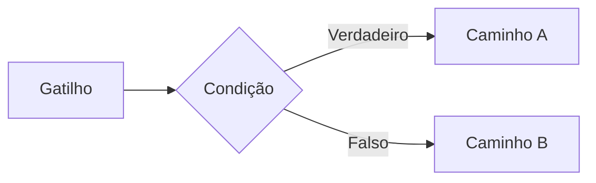
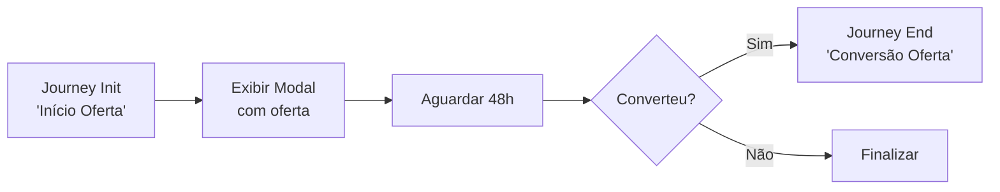

**Nesta página:**

- [O que são jornadas](#o-que-são-jornadas)
- [Conhecendo o Construtor de Fluxos](#conhecendo-o-construtor-de-fluxos)
- [Gatilhos: o que inicia uma jornada](#gatilhos-o-que-inicia-uma-jornada)
- [Condições: quem avança no fluxo](#condições-quem-avança-no-fluxo)
- [Ações: o que acontece](#ações-o-que-acontece)
- [Controle de fluxo: gerencie a lógica](#controle-de-fluxo-gerencie-a-lógica)
- [Integrações: conecte ferramentas externas](#integrações-conecte-ferramentas-externas)
- [Rastreamento: meça a performance](#rastreamento-meça-a-performance)
- [Objetivos e métricas](#objetivos-e-métricas)
- [Montando sua primeira jornada](#montando-sua-primeira-jornada)
- [Exemplos de jornadas comuns](#exemplos-de-jornadas-comuns)
- [Boas práticas](#boas-práticas)

---

## O que são jornadas

Uma jornada é uma **automação visual** que define o que acontece quando um visitante realiza uma ação ou atende a um critério no seu site. Você monta a lógica no **Construtor de Fluxos** conectando blocos, e a UserIn executa tudo em tempo real.

<Frame caption="Construtor de Fluxos: editor visual drag-and-drop para montar jornadas">
  
</Frame>

Jornadas operam em **tempo real**. Quando um visitante atende ao gatilho, o fluxo começa a ser executado imediatamente. Um mesmo visitante pode estar em múltiplas jornadas simultaneamente.

<div className="callout-blue">
  Jornadas são o motor de automação da UserIn. Tudo que aparece no site do visitante (modais, cards, smart blocks, mini games) é acionado por uma jornada.
</div>

### InSite e OffSite

Ao criar uma jornada, você define o **tipo de execução**:

| Tipo | Quando usar | Blocos disponíveis |
|------|-------------|-------------------|
| **InSite** | Visitante está navegando no site | Todos os blocos, incluindo ações visuais (modais, smart blocks, minigames, JavaScript, HTML) |
| **OffSite** | Visitante está fora do site | Ações de comunicação (email, SMS, push), automações de dados e integrações |

O tipo da jornada determina quais blocos aparecem no painel do Construtor de Fluxos. Blocos visuais (como Exibir Modal ou Personalizar Site) só estão disponíveis em jornadas InSite, pois dependem do visitante estar no site. O gatilho **Agendado** é exclusivo para jornadas OffSite.

<Tip>
  Se você precisa combinar ações no site e fora do site, use o bloco **Ir para Jornada** para redirecionar o visitante de uma jornada InSite para uma OffSite (ou vice-versa).
</Tip>

---

## Conhecendo o Construtor de Fluxos

O Construtor de Fluxos é um editor visual **drag-and-drop** onde você monta jornadas conectando blocos. Cada bloco tem uma função específica, e juntos formam a lógica completa da automação.

Os blocos são organizados em **seis categorias**:

<CardGroup cols={3}>
  <Card title="Gatilhos" icon="bolt">
    Definem **quando** a jornada é iniciada. Todo fluxo começa com pelo menos um gatilho.
  </Card>
  <Card title="Condições" icon="filter">
    Filtram **quem** avança. Verificam segmentos, atributos ou regras antes de prosseguir.
  </Card>
  <Card title="Ações" icon="play">
    Determinam **o que acontece**. Exibem componentes, enviam mensagens ou modificam dados.
  </Card>
  <Card title="Controle de Fluxo" icon="code-branch">
    Gerenciam a **lógica** da automação. Delays, caminhos paralelos, testes A/B.
  </Card>
  <Card title="Integrações" icon="plug">
    Conectam com **ferramentas externas** como Smartico e SendSpeed.
  </Card>
  <Card title="Rastreamento" icon="chart-simple">
    Medem a **performance**. Registram eventos, conversões e pontos de funil.
  </Card>
</CardGroup>

O fluxo é lido da esquerda para a direita (ou de cima para baixo). Cada bloco se conecta ao próximo, formando o caminho que o visitante percorre.

### Gerador de Jornadas com IA

Não precisa montar tudo manualmente. O **Gerador de Jornadas com IA** cria fluxos completos a partir de uma descrição em linguagem natural.

<Frame caption="Gerador de Jornadas com IA: descreva o fluxo e a IA monta a jornada completa">
  
</Frame>

<Steps>
  <Step title="Acesse o gerador">
    Na lista de jornadas, clique em **Gerar com IA**.
  </Step>
  <Step title="Descreva o fluxo">
    Escreva o que a jornada deve fazer. Seja específico sobre gatilhos, condições, ações e tempos de espera.
  </Step>
  <Step title="Revise e edite">
    A IA gera a jornada com todos os blocos e conexões. Você é redirecionado para o Construtor de Fluxos, onde pode ajustar qualquer detalhe antes de ativar.
  </Step>
</Steps>

**Exemplos de prompts que funcionam bem:**

| Prompt | O que a IA gera |
|--------|----------------|
| "Jornada de boas-vindas com delay de 2 dias e envio de email" | Gatilho de regra + delay + ação de email |
| "Se o visitante não comprar em 1 hora, manda push. Se depois de 1 dia não comprar, manda email com desconto" | Gatilho + aguardar evento + condição + push + delay + email |
| "Reativação de inativos há 30 dias com sequência de 3 emails" | Gatilho agendado + condição de inatividade + 3 emails com delays |

<Tip>
  Quanto mais detalhado o prompt, melhor o resultado. Inclua informações sobre tempo de espera, canais de comunicação e condições de decisão.
</Tip>

---

## Gatilhos: o que inicia uma jornada

Todo fluxo começa com um **gatilho**. É o evento ou condição que faz a jornada iniciar para um visitante. Sem gatilho, o fluxo nunca é executado.

<Tabs>
  <Tab title="Regra da Plataforma">
    O gatilho mais comum. A jornada inicia quando o visitante **atende aos critérios de uma regra** configurada na plataforma.

    | Propriedade | Descrição |
    |-------------|-----------|
    | Regra | Selecione qual regra da plataforma aciona o fluxo |
    | Avaliação | Tempo real (a cada evento do visitante) |
    | Reentrada | Configurável (permitir ou bloquear reentrada) |

    **Quando usar:** para jornadas baseadas em comportamento. Exemplo: quando o visitante é classificado como "alta intenção" ou "risco de churn".

    <Tip>
      Combine gatilhos de regra com condições de segmento para criar automações precisas. A regra identifica o momento, a condição refina a audiência.
    </Tip>
  </Tab>

  <Tab title="Agendado">
    A jornada é executada em **horários programados** usando expressões cron. Ideal para automações recorrentes que não dependem de um evento específico do visitante.

    | Propriedade | Descrição |
    |-------------|-----------|
    | Expressão cron | Define a frequência (ex: `0 9 * * 1` para toda segunda às 9h) |
    | Fuso horário | Timezone de referência para o agendamento |
    | Audiência | Todos os visitantes que atendem às condições do fluxo |

    **Quando usar:** para campanhas periódicas. Exemplo: toda segunda-feira, enviar um resumo semanal para visitantes engajados.
  </Tab>

  <Tab title="Trigger Manual">
    A jornada é iniciada por **código JavaScript** executado no site. Você controla exatamente quando o fluxo dispara via programação.

    ```javascript
    // Dispara a jornada quando o visitante clica em um botão específico
    userin.trigger('nome-do-trigger');
    ```

    | Propriedade | Descrição |
    |-------------|-----------|
    | Nome do trigger | Identificador único usado na chamada JavaScript |
    | Contexto | Pode receber dados adicionais via parâmetros |

    **Quando usar:** para jornadas acionadas por interações específicas do seu produto. Exemplo: visitante clicou em "Falar com vendas", disparar fluxo de qualificação.
  </Tab>

  <Tab title="Evento e Webhook">
    <Note>
      Estes gatilhos estão em desenvolvimento e serão disponibilizados em breve.
    </Note>

    **Evento:** a jornada inicia quando um evento customizado é recebido (via tracker ou API).

    **Webhook:** a jornada inicia quando um sistema externo envia uma requisição HTTP para o endpoint do fluxo.
  </Tab>
</Tabs>

---

## Condições: quem avança no fluxo

Condições funcionam como **filtros** dentro da jornada. Após o gatilho, você pode verificar critérios adicionais antes de executar uma ação. Visitantes que não atendem à condição seguem por um caminho alternativo (ou são descartados).



<AccordionGroup>
  <Accordion title="Verificar Segmento" icon="users-viewfinder" defaultOpen>
    Verifica se o visitante **pertence ou não** a um segmento específico.

    | Propriedade | Descrição |
    |-------------|-----------|
    | Segmento | Qual segmento verificar |
    | Operador | "pertence a" ou "não pertence a" |

    **Exemplo prático:** verificar se o visitante pertence ao segmento "clientes VIP" antes de exibir uma oferta exclusiva.

    Você pode encadear múltiplas verificações de segmento para criar filtros compostos.
  </Accordion>

  <Accordion title="Avaliar Atributo" icon="sliders">
    Avalia um **atributo específico** do perfil do visitante com operadores de comparação.

    | Propriedade | Descrição |
    |-------------|-----------|
    | Campo | Qual atributo do perfil avaliar |
    | Operador | igual, diferente, maior que, menor que, contém, existe, não existe |
    | Valor | Valor de referência para a comparação |

    **Exemplo prático:** verificar se `deposits.total > 500` para exibir componentes exclusivos para clientes de alto valor.

    Atributos disponíveis incluem campos de contato, financeiros, comportamentais e customizados (configurados na Ontologia).
  </Accordion>

  <Accordion title="Aplicar Regra" icon="list-check">
    Usa uma **regra da plataforma** como condição. Diferente do gatilho (que inicia o fluxo), aqui a regra funciona como um filtro intermediário.

    | Propriedade | Descrição |
    |-------------|-----------|
    | Regra | Qual regra avaliar |
    | Resultado | Caminho "verdadeiro" se o visitante atende, "falso" se não atende |

    **Exemplo prático:** o fluxo foi iniciado por um agendamento (cron), mas antes de exibir o modal, verificar se o visitante atende à regra de "engajamento mínimo".
  </Accordion>
</AccordionGroup>

<div className="callout-blue">
  Condições criam **bifurcações** no fluxo. Cada resultado (verdadeiro/falso) pode ter seu próprio caminho com ações diferentes. Use isso para personalizar a experiência por perfil.
</div>

---

## Ações: o que acontece

Ações são os blocos que **fazem alguma coisa** na jornada. São divididas em três grupos conforme o canal de execução.

<Tabs>
  <Tab title="Ações Padrão">
    Ações que modificam **dados internos** da plataforma. Não têm efeito visual direto no site do visitante.

    <AccordionGroup>
      <Accordion title="Adicionar Segmento" icon="circle-plus" defaultOpen>
        Inclui o visitante em um segmento específico. Útil para classificar visitantes com base no caminho que percorreram na jornada.

        | Propriedade | Descrição |
        |-------------|-----------|
        | Segmento | Qual segmento adicionar ao visitante |

        **Exemplo:** após o visitante converter, adicioná-lo ao segmento "Cliente Ativo".
      </Accordion>

      <Accordion title="Remover Segmento" icon="circle-minus">
        Remove o visitante de um segmento. Útil para reclassificar visitantes quando mudam de estágio.

        | Propriedade | Descrição |
        |-------------|-----------|
        | Segmento | Qual segmento remover do visitante |

        **Exemplo:** após a conversão, remover do segmento "Leads Quentes" e adicionar em "Cliente Ativo".
      </Accordion>
    </AccordionGroup>
  </Tab>

  <Tab title="Ações Insite">
    Ações que **aparecem no site** do visitante. São os componentes visuais que o visitante vê e interage.

    <AccordionGroup>
      <Accordion title="Exibir Modal" icon="window-maximize" defaultOpen>
        Mostra um modal (janela sobreposta) no site do visitante.

        | Propriedade | Descrição |
        |-------------|-----------|
        | Componente | Qual modal exibir |
        | Posição | Centro, canto inferior, tela cheia, etc. |
        | Animação | Fade, slide, zoom |

        Modais suportam personalização com variáveis Liquid e templates customizáveis.
      </Accordion>

      <Accordion title="Personalizar Site" icon="puzzle-piece">
        Injeta um Smart Block (bloco de conteúdo personalizado) em um container pré-definido na página.

        | Propriedade | Descrição |
        |-------------|-----------|
        | Componente | Qual Smart Block exibir |
        | Seletor CSS | Elemento da página onde o bloco será inserido |

        Smart Blocks se integram ao layout existente do site, mantendo a experiência visual consistente.
      </Accordion>

      <Accordion title="Exibir Mini Game" icon="dice">
        Apresenta uma mecânica de gamificação interativa ao visitante.

        | Propriedade | Descrição |
        |-------------|-----------|
        | Componente | Qual mini game exibir |
        | Mecânica | Roleta, raspadinha, flip card, gift box, prize drop ou slot machine |

        Mini Games aumentam o engajamento e podem captar leads em troca de recompensas.
      </Accordion>

      <Accordion title="Injetar HTML" icon="code">
        Insere um **bloco de HTML customizado** diretamente na página do visitante.

        | Propriedade | Descrição |
        |-------------|-----------|
        | Código HTML | O markup a ser injetado |
        | Seletor CSS | Onde inserir (antes, depois ou dentro do elemento) |
        | Posição | `beforebegin`, `afterbegin`, `beforeend`, `afterend` |

        Ideal para casos onde você precisa de controle total sobre o que aparece, sem usar um componente pré-configurado.
      </Accordion>

      <Accordion title="Executar JavaScript" icon="terminal">
        Executa um **script JavaScript** no navegador do visitante.

        | Propriedade | Descrição |
        |-------------|-----------|
        | Código JS | O script a ser executado |
        | Contexto | Tem acesso ao DOM e ao objeto `userin` |

        **Quando usar:** para integrações customizadas, manipulação de DOM avançada ou disparo de eventos em ferramentas de terceiros (analytics, pixels, etc.).

        <div className="callout-blue">
          Scripts executados via jornada têm acesso ao contexto do visitante. Use com cuidado e teste sempre em ambiente controlado antes de ativar para toda a audiência.
        </div>
      </Accordion>

      <Accordion title="Enviar Evento" icon="satellite-dish">
        Dispara um **evento customizado** no tracker do visitante. Útil para registrar ações que aconteceram como resultado da jornada.

        | Propriedade | Descrição |
        |-------------|-----------|
        | Nome do evento | Identificador do evento (ex: `promo_viewed`) |
        | Propriedades | Dados adicionais em formato chave-valor |

        Eventos disparados aqui aparecem no histórico do visitante e podem acionar outras jornadas.
      </Accordion>
    </AccordionGroup>
  </Tab>

  <Tab title="Ações Offsite">
    Ações que **saem do site** e alcançam o visitante por outros canais.

    <AccordionGroup>
      <Accordion title="Enviar SMS" icon="message-sms" defaultOpen>
        Envia uma mensagem SMS para o número de telefone do visitante.

        | Propriedade | Descrição |
        |-------------|-----------|
        | Mensagem | Texto do SMS (suporta variáveis Liquid) |
        | Remetente | Número ou nome do remetente |

        Requer que o visitante tenha telefone cadastrado no perfil. Integra com SendSpeed.
      </Accordion>

      <Accordion title="Enviar Email" icon="envelope">
        Envia um email para o endereço do visitante.

        | Propriedade | Descrição |
        |-------------|-----------|
        | Assunto | Título do email (suporta variáveis Liquid) |
        | Corpo | Conteúdo HTML ou texto do email |
        | Remetente | Email e nome do remetente |

        Suporta templates de email e personalização completa com variáveis Liquid.
      </Accordion>

      <Accordion title="Enviar Push" icon="bell">
        Envia uma notificação push para o dispositivo do visitante.

        | Propriedade | Descrição |
        |-------------|-----------|
        | Título | Título da notificação |
        | Corpo | Texto da notificação |
        | URL | Link de destino ao clicar |

        Requer que o visitante tenha aceito receber notificações push.
      </Accordion>

      <Accordion title="Chamar Webhook" icon="globe">
        Envia uma requisição HTTP para um **endpoint externo**. Permite integrar a jornada com qualquer sistema que aceite webhooks.

        | Propriedade | Descrição |
        |-------------|-----------|
        | URL | Endpoint de destino |
        | Método | GET, POST, PUT ou DELETE |
        | Headers | Cabeçalhos customizados (ex: autenticação) |
        | Body | Payload em JSON (suporta variáveis Liquid) |

        **Exemplo:** ao converter, enviar dados do visitante para seu CRM via webhook.
      </Accordion>
    </AccordionGroup>
  </Tab>
</Tabs>

---

## Controle de fluxo: gerencie a lógica

Blocos de controle definem **como** a jornada se comporta ao longo do tempo. Eles não executam ações diretas, mas controlam a sequência, o tempo e a distribuição dos visitantes.

<AccordionGroup>
  <Accordion title="Aguardar (Delay)" icon="clock" defaultOpen>
    Pausa a execução da jornada por um **período definido** antes de continuar para o próximo bloco.

    | Propriedade | Descrição |
    |-------------|-----------|
    | Duração | Tempo de espera |
    | Unidade | Segundos, minutos, horas, dias ou semanas |

    ```mermaid
    flowchart LR
        A["Exibir Modal"] --> B["Aguardar 24h"]
        B --> C{"Converteu?"}
        C -->|"Não"| D["Enviar Email"]
    ```

    **Quando usar:** para criar sequências com timing. Exemplo: exibir modal hoje, aguardar 24h, verificar se converteu, se não enviar email de lembrete.
  </Accordion>

  <Accordion title="Aguardar Evento" icon="hourglass">
    Pausa a jornada até que um **evento específico** ocorra para o visitante, ou até o **timeout** ser atingido. Diferente do delay (que espera um tempo fixo), aqui o fluxo reage a uma ação real do visitante.

    | Propriedade | Descrição |
    |-------------|-----------|
    | Evento esperado | Qual evento aguardar (compra, login, cadastro, primeiro depósito ou evento customizado) |
    | Timeout | Tempo máximo de espera antes de seguir pelo caminho alternativo |
    | Unidade do timeout | Segundos, minutos, horas, dias ou semanas |

    O bloco tem **dois caminhos de saída**:

    ```mermaid
    flowchart LR
        A["Ação anterior"] --> B["Aguardar Evento"]
        B -->|"Evento ocorreu"| C["Caminho de sucesso"]
        B -->|"Timeout"| D["Caminho alternativo"]
    ```

    **Quando usar:** para criar fluxos que reagem a ações do visitante com prazo. Exemplo: após exibir uma oferta, aguardar até 24h por uma compra. Se o visitante comprar, segue para agradecimento. Se não comprar (timeout), envia email de lembrete.

    <Tip>
      Use presets de timeout para os cenários mais comuns: 30 minutos, 1 hora, 24 horas, 3 dias ou 7 dias. Você também pode definir valores customizados.
    </Tip>
  </Accordion>

  <Accordion title="Caminhos Paralelos" icon="code-branch">
    Executa **múltiplas ações simultaneamente**. Cada caminho é independente e pode conter seus próprios blocos.

    ```mermaid
    flowchart LR
        A["Gatilho"] --> B["Caminho Paralelo"]
        B --> C["Exibir Modal"]
        B --> D["Enviar Email"]
        B --> E["Adicionar Segmento"]
    ```

    | Propriedade | Descrição |
    |-------------|-----------|
    | Caminhos | Número de ramificações paralelas |
    | Execução | Todos os caminhos iniciam ao mesmo tempo |

    **Quando usar:** quando você precisa executar ações diferentes que não dependem uma da outra. Exemplo: ao converter, exibir um componente de agradecimento E enviar email de confirmação E adicionar ao segmento "clientes".
  </Accordion>

  <Accordion title="Teste A/B" icon="vials">
    Divide visitantes em **variantes aleatórias** para testar abordagens diferentes. Cada variante recebe uma porcentagem do tráfego.

    ```mermaid
    flowchart LR
        A["Gatilho"] --> B["Teste A/B"]
        B -->|"50%"| C["Variante A:<br/>Modal com desconto"]
        B -->|"50%"| D["Variante B:<br/>Modal com frete grátis"]
    ```

    | Propriedade | Descrição |
    |-------------|-----------|
    | Variantes | Número de caminhos (2 ou mais) |
    | Distribuição | Porcentagem de tráfego para cada variante |
    | Persistência | Visitante sempre recebe a mesma variante |

    **Quando usar:** para descobrir qual abordagem gera mais resultado. Teste copy, formato de componente, oferta, timing.

    <Tip>
      Mantenha testes A/B simples: mude **uma variável por vez**. Se você alterar o copy e o formato ao mesmo tempo, não saberá qual mudança causou o impacto.
    </Tip>
  </Accordion>

  <Accordion title="Ir para Outro Fluxo" icon="arrow-right-to-bracket">
    **Redireciona** o visitante para outra jornada. O fluxo atual é encerrado e o visitante entra no fluxo de destino.

    | Propriedade | Descrição |
    |-------------|-----------|
    | Fluxo de destino | Qual jornada recebe o visitante |
    | Passar contexto | Se ativado, envia os dados do visitante para a jornada de destino |

    Ao conectar jornadas, a plataforma cria automaticamente um gatilho **Origem: Jornada** no fluxo de destino, indicando de onde os visitantes estão vindo. Esse gatilho é gerenciado automaticamente e não pode ser adicionado ou removido manualmente.

    **Quando usar:** para organizar automações complexas em fluxos menores e reutilizáveis. Exemplo: um fluxo genérico de qualificação que, ao final, direciona para fluxos específicos por perfil.
  </Accordion>

  <Accordion title="Finalizar" icon="flag-checkered">
    **Encerra** a jornada para o visitante. Nenhum bloco posterior é executado.

    **Quando usar:** para criar pontos de saída explícitos. Exemplo: se o visitante já converteu, finalizar o fluxo em vez de continuar com ações de conversão.
  </Accordion>
</AccordionGroup>

---

## Integrações: conecte ferramentas externas

Blocos de integração permitem que a jornada se comunique com **plataformas parceiras** da UserIn. Cada integração disponibiliza ações específicas do serviço conectado.

<CardGroup cols={2}>
  <Card title="Smartico" icon="trophy">
    Plataforma de **gamificação e CRM**. Permite sincronizar dados de visitantes, criar missões, atribuir pontos e gerenciar recompensas diretamente a partir de jornadas.

    **Ações disponíveis:**
    - Sincronizar perfil do visitante
    - Atribuir pontos ou recompensas
    - Criar missão para o visitante
    - Atualizar nível ou tier
  </Card>
  <Card title="SendSpeed" icon="paper-plane">
    Plataforma de **mensageria multicanal**. Permite enviar comunicações via SMS, email e push com dados enriquecidos do perfil UserIn.

    **Ações disponíveis:**
    - Enviar SMS personalizado
    - Enviar email com template
    - Disparar notificação push
    - Acionar campanha específica
  </Card>
</CardGroup>

<Note>
  Integrações precisam ser configuradas em **Configurações > API Keys** antes de serem usadas nas jornadas. Verifique se as credenciais estão ativas.
</Note>

---

## Rastreamento: meça a performance

Blocos de rastreamento permitem **medir o impacto** de cada jornada. Eles registram eventos e conversões em pontos específicos do fluxo, permitindo análises detalhadas de performance.

| Bloco | O que faz | Quando usar |
|-------|-----------|-------------|
| **Track Event** | Registra um evento customizado no perfil do visitante | Para marcar que o visitante passou por um ponto específico da jornada |
| **Track Conversion** | Registra uma conversão com valor monetário associado | Para medir receita gerada pela jornada |
| **Journey Init** | Marca o **início** de um trecho de medição no funil | Para definir o ponto de partida da análise de conversão |
| **Journey End** | Marca o **fim** de um trecho de medição no funil | Para definir o ponto de chegada da análise de conversão |

### Como medir um funil dentro da jornada

Use `Journey Init` e `Journey End` para criar **trechos mensuráveis** no fluxo. A taxa de conversão entre os dois pontos é calculada automaticamente.



Neste exemplo, a plataforma calcula automaticamente quantos visitantes que passaram pelo `Journey Init` chegaram ao `Journey End`, dando a taxa de conversão real da oferta.

<Tip>
  Posicione blocos de rastreamento em pontos estratégicos. Não precisa rastrear cada passo: foque em **entradas de funil** (Journey Init) e **conversões** (Journey End / Track Conversion).
</Tip>

---

## Objetivos e métricas

Cada jornada pode ter um **objetivo** e **métricas de sucesso** associados, permitindo monitorar se a automação está atingindo o resultado esperado diretamente no dashboard de analytics.

### Objetivo

Ao criar ou editar uma jornada, você pode selecionar um objetivo que define a intenção do fluxo. Objetivos são organizados por estágio do visitante:

| Estágio | Exemplos de objetivo |
|---------|---------------------|
| Visitante | Captar email, gerar primeiro cadastro |
| Registrado | Ativar conta, gerar primeira conversão |
| Ativo | Aumentar frequência, cross-sell |
| Churned | Reativação, win-back |

### Métricas de sucesso (KPIs)

Com um objetivo selecionado, você pode configurar **métricas de sucesso** com targets. A plataforma monitora o desempenho automaticamente e indica o status visual de cada KPI:

| Status | Significado |
|--------|-------------|
| Sem meta | Nenhum target definido, apenas acompanhamento |
| Na meta | Performance dentro do esperado |
| Abaixo da meta | Precisa de atenção |
| Crítico | Muito abaixo do esperado |

Os KPIs ficam visíveis no header do Construtor de Fluxos e na página de Analytics da jornada.

### Modelo de atribuição

Para jornadas com conversões, você pode escolher o **modelo de atribuição** que define como o crédito é distribuído entre as interações:

| Modelo | Como funciona |
|--------|---------------|
| Last Touch | Crédito vai para a última interação antes da conversão |
| First Touch | Crédito vai para a primeira interação |
| Linear | Crédito distribuído igualmente entre todas as interações |
| Time Decay | Interações mais recentes recebem mais crédito |
| Position Based | Primeira e última interações recebem mais crédito |

Você também configura a **janela de atribuição**: o período máximo entre a interação e a conversão para que o crédito seja computado.

<Tip>
  Configure objetivos e métricas antes de ativar a jornada. Isso permite acompanhar a performance desde o primeiro dia e comparar resultados entre jornadas com o mesmo objetivo.
</Tip>

---

## Montando sua primeira jornada

Vamos criar uma jornada completa do zero. O cenário: exibir um modal de oferta para visitantes de alta intenção que ainda não são clientes, aguardar 24h e, se não converteram, enviar um email de lembrete.

<Steps>
  <Step title="Acesse o Construtor de Fluxos">
    No menu lateral da plataforma, clique em **Jornadas** e depois em **Criar nova jornada**. O Construtor de Fluxos abre com uma tela vazia pronta para receber blocos.
  </Step>

  <Step title="Adicione o gatilho">
    Arraste o bloco **Regra da Plataforma** para a tela. Selecione a regra que identifica visitantes com alta intenção de compra.

    Esse gatilho faz o fluxo iniciar automaticamente quando o visitante atende aos critérios da regra.
  </Step>

  <Step title="Adicione uma condição">
    Conecte um bloco de **Verificar Segmento** ao gatilho. Configure para verificar se o visitante **não pertence** ao segmento "Cliente Ativo".

    Isso garante que a oferta só apareça para quem ainda não converteu.
  </Step>

  <Step title="Adicione o Journey Init">
    Conecte um bloco de **Journey Init** no caminho "verdadeiro" da condição. Nomeie como "Início Oferta Conversão". Isso marca o início do trecho de medição.
  </Step>

  <Step title="Adicione a ação de exibição">
    Conecte um bloco **Exibir Modal** ao Journey Init. Selecione o modal com a oferta de conversão que você configurou previamente em Componentes.
  </Step>

  <Step title="Adicione o delay">
    Conecte um bloco **Aguardar** ao modal. Configure para **24 horas**. O fluxo pausa aqui e retoma no dia seguinte.
  </Step>

  <Step title="Adicione verificação de conversão">
    Conecte outro bloco de **Verificar Segmento** após o delay. Verifique se o visitante agora **pertence** ao segmento "Cliente Ativo".
  </Step>

  <Step title="Configure os caminhos finais">
    No caminho **"Sim"** (converteu): adicione um bloco **Journey End** nomeado "Conversão Oferta" e depois um **Track Conversion** com o valor da conversão.

    No caminho **"Não"** (não converteu): adicione um bloco **Enviar Email** com um lembrete da oferta.
  </Step>

  <Step title="Revise e ative">
    Clique em **Preview** para revisar toda a jornada visualmente. Verifique se os blocos estão conectados corretamente e se as configurações estão certas. Quando estiver satisfeito, clique em **Ativar**.
  </Step>
</Steps>

---

## Exemplos de jornadas comuns

Cenários recorrentes que você pode replicar e adaptar para o seu contexto.

<AccordionGroup>
  <Accordion title="Boas-vindas para novos visitantes" icon="hand-wave" defaultOpen>
    **Objetivo:** captar o email de visitantes na primeira sessão.

    ```mermaid
    flowchart LR
        A["Regra: Primeira visita"] --> B{"Tem email?"}
        B -->|"Não"| C["Exibir Modal<br/>'Cadastre-se e ganhe 10%'"]
        B -->|"Sim"| D["Finalizar"]
    ```

    **Blocos usados:** Regra da Plataforma → Verificar Atributo (`contact.email` existe) → Exibir Modal → Finalizar
  </Accordion>

  <Accordion title="Recuperação de visitantes inativos" icon="user-clock">
    **Objetivo:** reengajar visitantes que não acessam há mais de 14 dias.

    ```mermaid
    flowchart LR
        A["Agendado: Diário às 10h"] --> B{"Inativo há 14+ dias?"}
        B -->|"Sim"| C["Enviar Email<br/>'Sentimos sua falta'"]
        C --> D["Aguardar 3 dias"]
        D --> E{"Voltou?"}
        E -->|"Não"| F["Enviar SMS<br/>com oferta"]
        E -->|"Sim"| G["Personalizar Site<br/>'Bem-vindo de volta'"]
    ```

    **Blocos usados:** Agendado → Avaliar Atributo → Enviar Email → Aguardar → Verificar Segmento → Enviar SMS / Personalizar Site
  </Accordion>

  <Accordion title="Teste A/B de ofertas" icon="flask-vial">
    **Objetivo:** descobrir qual tipo de incentivo gera mais conversão.

    ```mermaid
    flowchart LR
        A["Regra: Alta Intenção"] --> B["Teste A/B"]
        B -->|"33%"| C["Modal: 15% desconto"]
        B -->|"33%"| D["Modal: Frete grátis"]
        B -->|"34%"| E["Modal: Brinde exclusivo"]
        C --> F["Track Conversion"]
        D --> F
        E --> F
    ```

    **Blocos usados:** Regra da Plataforma → Teste A/B (3 variantes) → Exibir Modal (3 versões) → Track Conversion
  </Accordion>

  <Accordion title="Gamificação para engajamento" icon="gamepad">
    **Objetivo:** aumentar o tempo de permanência e interação com mini games.

    ```mermaid
    flowchart LR
        A["Regra: 3+ sessões<br/>sem conversão"] --> B{"Já jogou?"}
        B -->|"Não"| C["Exibir Mini Game<br/>Roleta de Prêmios"]
        C --> D["Track Event<br/>'minigame_played'"]
        D --> E["Adicionar Segmento<br/>'Engajado com Games'"]
        B -->|"Sim"| F["Finalizar"]
    ```

    **Blocos usados:** Regra da Plataforma → Verificar Segmento → Exibir Mini Game → Track Event → Adicionar Segmento
  </Accordion>
</AccordionGroup>

---

## Boas práticas

<AccordionGroup>
  <Accordion title="Comece simples e evolua" icon="seedling" defaultOpen>
    Jornadas complexas com muitas ramificações são difíceis de debugar. Comece com fluxos de 3 a 5 blocos. Valide o resultado. Depois adicione condições, delays e caminhos alternativos gradualmente.
  </Accordion>

  <Accordion title="Nomeie seus fluxos com padrão" icon="tag">
    Use uma convenção clara para facilitar a gestão. Sugestão: **[Objetivo] - [Audiência] - [Canal]**.

    Exemplos:
    - "Conversão - Alta Intenção - Modal"
    - "Reativação - Inativos 30d - Email + SMS"
    - "Engajamento - Novos Visitantes - Mini Game"
  </Accordion>

  <Accordion title="Use Journey Init e Journey End para medir tudo" icon="chart-line">
    Sem rastreamento, você não sabe se a jornada está funcionando. Coloque `Journey Init` no começo do trecho que quer medir e `Journey End` no ponto de sucesso. A taxa de conversão entre os dois é calculada automaticamente.
  </Accordion>

  <Accordion title="Evite loops infinitos" icon="circle-exclamation">
    Cuidado ao combinar o bloco "Ir para outro fluxo" com gatilhos de regra. Se o fluxo A envia para o fluxo B, e o fluxo B envia de volta para A, você cria um loop. Revise sempre os caminhos antes de ativar.
  </Accordion>

  <Accordion title="Teste com perfis reais antes de ativar" icon="flask">
    Use o modo preview para simular a jornada com um perfil de visitante real. Verifique se as condições estão filtrando corretamente, se as ações estão executando e se os delays estão configurados com o tempo certo.
  </Accordion>

  <Accordion title="Respeite os canais do visitante" icon="shield-halved">
    Ações offsite (SMS, email, push) dependem de dados de contato. Sempre verifique se o visitante tem telefone/email antes de enviar. Use condições de atributo (`contact.email existe`) para evitar erros silenciosos.
  </Accordion>

  <Accordion title="Defina objetivos e métricas desde o início" icon="target">
    Antes de ativar uma jornada, selecione um **objetivo** e configure **métricas de sucesso** com targets. Isso permite acompanhar o desempenho desde o primeiro dia e facilita a comparação entre jornadas com a mesma finalidade.
  </Accordion>

  <Accordion title="Use Aguardar Evento para fluxos reativos" icon="hourglass">
    Quando o próximo passo depende de uma ação do visitante (como uma compra ou cadastro), prefira o bloco **Aguardar Evento** ao invés de combinar delay + condição. Ele é mais preciso e reage em tempo real quando o evento ocorre.
  </Accordion>
</AccordionGroup>

---

## Próximos passos

<CardGroup cols={2}>
  <Card
    title="Ontologia de Dados"
    icon="diagram-project"
    href="/plataforma/ontologia"
  >
    Entenda como os dados são organizados e como criar campos customizados.
  </Card>
  <Card
    title="Criando Componentes"
    icon="puzzle-piece"
    href="/componentes/criando-componentes"
  >
    Configure os componentes visuais que suas jornadas vão exibir.
  </Card>
  <Card
    title="Personalização com Variáveis"
    icon="wand-magic-sparkles"
    href="/plataforma/personalizacao-liquid"
  >
    Use variáveis Liquid para personalizar conteúdo nas ações da jornada.
  </Card>
  <Card
    title="Sinais e Outputs"
    icon="signal"
    href="/plataforma/sinais-e-outputs"
  >
    Configure sinais computados que podem ser usados como condições nas jornadas.
  </Card>
</CardGroup>
