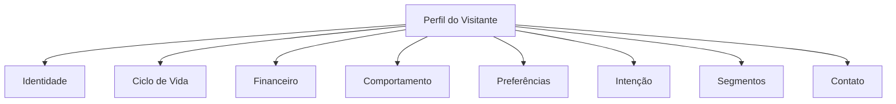
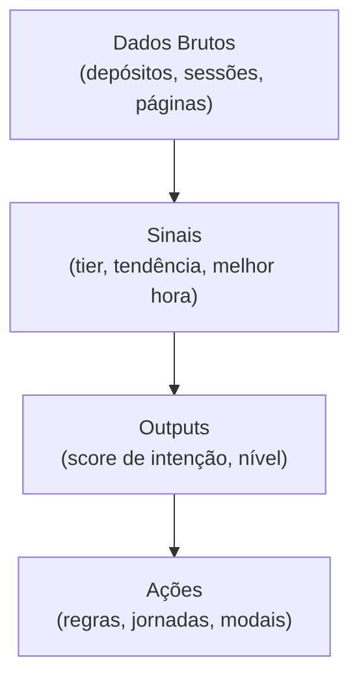

A ontologia é a forma como a UserIn organiza **todos os dados** que conhece sobre cada visitante do seu site. Pense nela como a ficha completa de cada pessoa: quem é, o que fez, quanto gastou, quando acessa e o que provavelmente vai fazer a seguir.

  Você não precisa entender os detalhes técnicos da ontologia para usar a plataforma. Mas conhecer como os dados são organizados vai te ajudar a criar regras, segmentos e automações mais eficientes.

**Nesta página:**

- [Como os dados são organizados](#como-os-dados-são-organizados)
- [Os 4 tipos de dados](#os-4-tipos-de-dados)
- [Referência de campos](#referência-de-campos)
- [Sinais: interpretações inteligentes](#sinais-interpretações-inteligentes)
- [Outputs: resultados de IA](#outputs-resultados-de-ia)
- [Sinais customizados](#sinais-customizados)
- [Campos por categoria de negócio](#campos-por-categoria-de-negócio)
- [Campos customizados](#campos-customizados)
- [Como usar campos em condições](#como-usar-campos-em-condições)
- [Exemplos práticos](#exemplos-práticos)
- [Onde a ontologia aparece na plataforma](#onde-a-ontologia-aparece-na-plataforma)

---

## Como os dados são organizados

Cada visitante tem um **perfil** que acumula informações ao longo do tempo. Esses dados são organizados em **grupos** temáticos:

<AccordionGroup>
  <Accordion title="Identidade" icon="user">
    Dados que identificam o visitante: ID externo, visitor ID, data do primeiro acesso. Esses campos são preenchidos automaticamente pelo tracker e pela integração com seu sistema.
  </Accordion>

  <Accordion title="Ciclo de Vida" icon="arrows-spin">
    O **estágio** atual do visitante na jornada de cliente:
    - **Anônimo**: visitou o site mas ainda não se identificou
    - **Registrado**: criou conta ou se identificou
    - **FTD**: fez a primeira compra/transação
    - **Recorrente**: fez mais de uma compra/transação
  </Accordion>

  <Accordion title="Financeiro" icon="dollar-sign">
    Tudo sobre transações: total gasto, quantidade de compras, ticket médio, valor da primeira compra, tendência de gastos (aumentando, estável ou diminuindo) e classificação por faixa de valor.
  </Accordion>

  <Accordion title="Comportamento" icon="chart-line">
    Como o visitante interage com seu site: total de sessões, duração média, frequência semanal, quantidade de dispositivos usados e páginas visitadas.
  </Accordion>

  <Accordion title="Preferências" icon="heart">
    O que o visitante mais acessa: páginas mais visitadas, categorias preferidas e padrões de navegação. Os campos de preferência variam conforme a categoria do seu negócio.
  </Accordion>

  <Accordion title="Intenção" icon="crosshairs">
    A probabilidade de o visitante converter (fazer uma compra, se registrar, etc.). Calculada automaticamente pela IA da UserIn com base no comportamento, engajamento e recência.
  </Accordion>

  <Accordion title="Segmentos" icon="users-viewfinder">
    Rótulos dinâmicos aplicados ao visitante pelas suas regras e automações. Por exemplo: "VIP", "carrinho_abandonado", "risco_churn". Você controla quais segmentos existem e as condições para entrar ou sair deles.
  </Accordion>

  <Accordion title="Contato" icon="address-book">
    Informações de contato capturadas: nome, email, telefone. Usadas para personalização de mensagens e campanhas.
  </Accordion>
</AccordionGroup>

## Os 4 tipos de dados

Nem todos os campos são iguais. A UserIn classifica cada dado do perfil em 4 categorias:

<CardGroup cols={2}>
  <Card title="Atributos" icon="database">
    **Fatos imutáveis.** Dados que não mudam depois de registrados. Exemplo: data do primeiro acesso, valor da primeira compra, email.
  </Card>
  <Card title="Agregados" icon="calculator">
    **Totais e médias.** Números que a plataforma calcula automaticamente somando eventos. Exemplo: total gasto, quantidade de sessões, ticket médio.
  </Card>
  <Card title="Sinais" icon="signal">
    **Interpretações inteligentes.** Derivados dos dados brutos usando janelas temporais e regras. Exemplo: tendência de gastos (aumentando/diminuindo), melhor horário para contato, classificação por tier.
  </Card>
  <Card title="Outputs" icon="brain">
    **Resultados de IA.** Valores calculados por modelos que combinam múltiplos sinais. Exemplo: score de intenção (0-100), nível de intenção (alto/médio/baixo), próximo passo recomendado.
  </Card>
</CardGroup>

<Tip>
  **Na prática**, você não precisa se preocupar com essas categorias ao criar regras. Todos os campos aparecem juntos no construtor de condições. Mas é útil saber que um "Score de Intenção" (output) é mais sofisticado que um simples "Total Gasto" (agregado).
</Tip>

---

## Referência de campos

Cada visitante acumula dados em seu perfil. Abaixo estão todos os campos que você pode usar para criar regras, segmentos e personalizar conteúdo.

  Campos disponíveis em **Regras** podem ser usados como condição em regras e jornadas. Campos disponíveis em **Liquid** podem ser usados para personalizar textos em templates via variáveis.

### Ciclo de Vida

O campo mais importante para segmentar seus visitantes.

| Campo | Descrição | Valores possíveis |
|-------|-----------|-------------------|
| **Estágio** | Fase atual do visitante na jornada de cliente | Anônimo, Registrado, FTD, Recorrente |

<Tip>
  Use o estágio como primeira condição nas suas regras. Por exemplo: "Se o estágio é **Anônimo** E visitou a página de preços" para exibir um modal de cadastro.
</Tip>

### Financeiro

Dados sobre transações e gastos do visitante.

| Campo | Descrição | Tipo | Exemplo |
|-------|-----------|------|---------|
| **Total Depositado** | Soma de todos os valores | Número | R$ 2.500 |
| **Qtd. de Depósitos** | Quantas transações realizou | Número | 8 |
| **Ticket Médio** | Valor médio por transação | Número | R$ 312,50 |
| **Valor do 1o Depósito** | Quanto pagou na primeira vez | Número | R$ 50 |
| **Dias Desde Último Depósito** | Há quanto tempo não compra | Número | 14 |
| **Tier de Depósitos** | Classificação por faixa de valor | Lista | None, Low, Medium, High, Whale |
| **Tendência** | Os gastos estão subindo ou caindo? | Lista | Aumentando, Estável, Diminuindo |

### Comportamento

Como o visitante interage com seu site.

| Campo | Descrição | Tipo | Exemplo |
|-------|-----------|------|---------|
| **Total de Sessões** | Quantas vezes visitou o site | Número | 42 |
| **Duração Média** | Tempo médio por visita (minutos) | Número | 8,5 |
| **Sessões por Semana** | Frequência de acesso | Número | 3,2 |
| **Dispositivos** | Quantos aparelhos diferentes usou | Número | 2 |

### Temporal

Quando o visitante acessa e o melhor momento para contatá-lo.

| Campo | Descrição | Tipo | Exemplo |
|-------|-----------|------|---------|
| **Primeiro Acesso** | Data e hora da primeira visita | Data | 15/01/2026 |
| **Última Atualização** | Quando o perfil foi atualizado | Data | 19/02/2026 |
| **Melhor Hora** | Hora do dia mais ativa (0-23) | Número | 14 |
| **Melhor Dia da Semana** | Dia mais ativo (Dom=0, Sáb=6) | Número | 2 (Terça) |

<Tip>
  O campo **Melhor Hora** é calculado automaticamente pela plataforma analisando o padrão de sessões do visitante. Use-o para agendar envio de SMS e emails no horário ideal.
</Tip>

### Preferências

O que o visitante mais gosta e procura.

| Campo | Descrição | Tipo | Exemplo |
|-------|-----------|------|---------|
| **Total de Page Views** | Quantas páginas viu no total | Número | 156 |
| **Páginas Únicas** | Quantas páginas diferentes visitou | Número | 23 |
| **Visitas Casino** | Acessos a páginas de cassino | Número | 12 |
| **Visitas Sports** | Acessos a páginas esportivas | Número | 8 |
| **Visitas Slots** | Acessos a páginas de slots | Número | 15 |

  Campos de preferência por tipo de conteúdo (como Visitas Casino, Visitas Sports e Visitas Slots) ficam disponíveis de acordo com a categoria do seu negócio. Veja <a href="#campos-por-categoria-de-negócio">Campos por categoria</a> para mais detalhes.

### Navegação

Dados detalhados sobre as páginas visitadas.

| Campo | Descrição | Tipo |
|-------|-----------|------|
| **Páginas da Última Sessão** | Lista de páginas da sessão atual | Lista |
| **Todas as Páginas Visitadas** | Histórico completo de páginas | Lista |

<Tip>
  Use "Páginas da Última Sessão *contém* /precos" para detectar visitantes que estão avaliando seus planos neste momento.
</Tip>

### Saldo em Tempo Real

Monitoramento de saldo durante a sessão do visitante. Disponível para categorias de negócio que utilizam saldo em tempo real.

| Campo | Descrição | Tipo | Exemplo |
|-------|-----------|------|---------|
| **Saldo Atual** | Saldo neste momento | Número | R$ 200 |
| **Saldo Início Sessão** | Saldo quando entrou | Número | R$ 500 |
| **Ganhou/Perdeu (R$)** | Diferença na sessão | Número | -R$ 300 |
| **Ganhou/Perdeu (%)** | Variação percentual | Número | -60% |

  Campos de Saldo em Tempo Real são atualizados apenas durante a sessão ativa do visitante e exigem integração com a plataforma do cliente.

### Intenção (Outputs de IA)

Valores calculados automaticamente pela IA da UserIn. Veja a seção [Outputs: resultados de IA](#outputs-resultados-de-ia) para detalhes sobre como são calculados.

| Campo | Descrição | Tipo | Exemplo |
|-------|-----------|------|---------|
| **Score de Intenção** | Probabilidade de converter (0-100) | Número | 78 |
| **Nível de Intenção** | Classificação simplificada | Lista | Alto, Médio, Baixo |
| **Próximo Passo** | Recomendação da IA | Texto | "Oferecer bônus de primeiro depósito" |

  O Score de Intenção é recalculado diariamente e leva em conta: frequência de sessões, duração, páginas visitadas, estágio do visitante e padrão de navegação.

### Segmentos

Segmentos são rótulos que **você controla**. Diferente dos outros campos que são calculados automaticamente, os segmentos são adicionados e removidos pelas suas jornadas e regras.

| Operação | Descrição | Exemplo |
|----------|-----------|---------|
| **Tem Segmento** | Verifica se o visitante possui um segmento | Tem segmento "VIP" |
| **Não Tem Segmento** | Verifica se NÃO possui um segmento | Não tem segmento "onboarding_completo" |

Segmentos comuns:

| Segmento | Uso |
|----------|-----|
| `vip` | Cliente de alto valor |
| `churn_risk` | Risco de abandono |
| `onboarding_completo` | Concluiu o fluxo inicial |
| `carrinho_abandonado` | Deixou itens no carrinho |
| `primeiro_deposito` | Acabou de fazer a primeira compra |

### Contato

Informações pessoais capturadas via formulário, integração ou API.

| Campo | Descrição | Personalização |
|-------|-----------|---------------|
| **Nome** | Nome completo | `{{contact.firstName}}` |
| **Sobrenome** | Apelido/último nome | `{{contact.lastName}}` |
| **Email** | Endereço de email | `{{contact.email}}` |
| **Telefone** | Número de telefone | `{{contact.phone}}` |

### Jogos

Dados de entidades conectadas ao perfil do visitante. Disponíveis para categorias de negócio que trabalham com catálogo de jogos.

| Campo | Descrição | Personalização |
|-------|-----------|---------------|
| **Nome do Jogo** | Nome do jogo favorito | `{{game.name}}` |
| **Categoria** | Tipo do jogo | `{{game.category}}` |
| **Provedor** | Empresa que fornece o jogo | `{{game.provider}}` |
| **URL** | Link para o jogo | `{{game.url}}` |
| **RTP** | Percentual de retorno ao jogador | `{{game.rtp}}` |

---

## Sinais: interpretações inteligentes

A UserIn não mostra apenas números crus. Ela **interpreta** os dados dos seus visitantes automaticamente para gerar insights que facilitam a tomada de decisão.

Sinais são **derivações** dos dados brutos. Eles respondem perguntas como "esse cliente está gastando mais ou menos?" ou "qual o melhor horário para falar com ele?".

<AccordionGroup>
  <Accordion title="Tier de Depósitos" icon="layer-group">
    Classifica o visitante por faixa de valor total gasto:

    | Tier | Faixa de Valor | Significado |
    |------|---------------|-------------|
    | **None** | R$ 0 | Nunca comprou |
    | **Low** | R$ 1 - R$ 100 | Comprador inicial |
    | **Medium** | R$ 100 - R$ 500 | Comprador moderado |
    | **High** | R$ 500 - R$ 2.000 | Comprador de alto valor |
    | **Whale** | R$ 2.000+ | Comprador premium |

    **Atualizado:** em tempo real, a cada nova transação.

    **Exemplo de uso:** Exibir modal VIP automaticamente quando o tier mudar para "High" ou "Whale".
  </Accordion>

  <Accordion title="Tendência de Depósitos" icon="chart-line">
    Analisa se os gastos do visitante estão subindo, estáveis ou caindo nas últimas semanas:

    | Tendência | Significado |
    |-----------|-------------|
    | **Aumentando** | Gastando mais que o habitual |
    | **Estável** | Mantendo o padrão |
    | **Diminuindo** | Gastando menos que o habitual |

    **Atualizado:** semanalmente, analisando as últimas 5 semanas.

    **Exemplo de uso:** Se a tendência é "Diminuindo" e o tier é "High", disparar campanha de retenção.
  </Accordion>

  <Accordion title="Melhor Horário de Contato" icon="clock">
    Calcula automaticamente a hora do dia e o dia da semana em que o visitante mais acessa seu site:

    - **Melhor Hora:** 0-23 (ex: 14 = 14h)
    - **Melhor Dia:** Domingo a Sábado

    **Atualizado:** diariamente, analisando o histórico de sessões.

    **Exemplo de uso:** Agendar envio de SMS promocional no horário em que o visitante está mais ativo.
  </Accordion>

  <Accordion title="Dias Desde Último Depósito" icon="calendar-days">
    Conta automaticamente quantos dias se passaram desde a última transação. Aumenta a cada dia que passa sem compra.

    **Atualizado:** em tempo real (calculado dinamicamente).

    **Exemplo de uso:** Se dias desde último depósito é maior que 30, adicionar segmento "inativo" e iniciar jornada de reativação.
  </Accordion>

  <Accordion title="Variação de Saldo na Sessão" icon="arrow-trend-down">
    Para plataformas que monitoram saldo em tempo real, acompanha quanto o visitante ganhou ou perdeu na sessão atual:

    - **Valor (R$):** diferença entre saldo atual e inicial
    - **Percentual (%):** variação relativa

    **Atualizado:** em tempo real durante a sessão.

    **Exemplo de uso:** Se perdeu mais de 50% do saldo, exibir modal com alerta personalizado.
  </Accordion>
</AccordionGroup>

---

## Outputs: resultados de IA

Outputs são o nível mais sofisticado de análise. Eles combinam **múltiplos sinais e dados** usando modelos de inteligência artificial para produzir uma avaliação final.

### Score de Intenção

O output principal da UserIn. Um número de **0 a 100** que representa a probabilidade do visitante converter (fazer uma compra, se registrar, etc.).

<CardGroup cols={3}>
  <Card title="0-39: Baixa" icon="circle-arrow-down">
    Visitante casual ou desinteressado. Poucas sessões, pouco engajamento.
  </Card>
  <Card title="40-69: Média" icon="circle-arrow-right">
    Demonstra interesse mas ainda não decidiu. Visitando páginas relevantes com alguma frequência.
  </Card>
  <Card title="70-100: Alta" icon="circle-arrow-up">
    Alta probabilidade de converter. Engajamento consistente, múltiplas sessões, explorando conteúdo de conversão.
  </Card>
</CardGroup>

#### Como é calculado?

O score considera automaticamente:

| Fator | Peso | Exemplo |
|-------|------|---------|
| **Estágio do visitante** | Alto | Registrado vale mais que anônimo |
| **Sessões por semana** | Médio | Mais sessões = mais interesse |
| **Duração das sessões** | Médio | Visitas longas indicam engajamento |
| **Páginas visitadas** | Médio | Diversidade de páginas exploradas |
| **Recência** | Alto | Visita recente vale mais |

  O Score de Intenção é recalculado **diariamente** para cada visitante ativo. Visitantes sem sessão recente vão perdendo score gradualmente.

### Nível de Intenção

Versão simplificada do score, em 3 categorias:

| Nível | Score | Uso recomendado |
|-------|-------|-----------------|
| **Alto** | 70-100 | Prioridade máxima. Ofereça conversão imediata. |
| **Médio** | 40-69 | Nutra com conteúdo relevante. |
| **Baixo** | 0-39 | Evite comunicação agressiva. |

### Próximo Passo (Next Step)

Uma recomendação textual gerada pela IA sobre qual ação tomar com o visitante. Exemplos:

- *"Oferecer bônus de primeiro depósito"*
- *"Enviar lembrete de carrinho abandonado"*
- *"Apresentar programa VIP"*
- *"Risco de churn, ativar retenção"*

---

## Sinais customizados

Além dos sinais do sistema, você pode **criar seus próprios sinais** no Painel de Ontologia:

<Steps>
  <Step title="Acesse Estrutura de automações no menu lateral">
    Navegue até o Painel de Ontologia.
  </Step>
  <Step title="Crie um novo Sinal">
    Defina o nome, tipo de resultado (sim/não, número, texto, lista) e a fórmula de cálculo.
  </Step>
  <Step title="Defina as condições">
    Configure a lógica usando os campos existentes. Por exemplo: "Se deposits.total > 1000 E deposits.trend = diminuindo, então vip_decline_flag = verdadeiro".
  </Step>
  <Step title="Ative o sinal">
    Após salvar, o sinal será calculado automaticamente para todos os visitantes da sua empresa.
  </Step>
</Steps>

### Exemplo: Sinal de Declínio VIP

Um sinal customizado que identifica clientes VIP que estão diminuindo gastos:

| Propriedade | Valor |
|-------------|-------|
| **Nome** | vip_decline_flag |
| **Tipo** | Sim/Não (boolean) |
| **Condição** | deposits.total > 1000 E deposits.trend = diminuindo |
| **Uso** | Disparar jornada de retenção VIP |

  Sinais customizados dependem dos campos que você usar como base. Certifique-se de que os dados estão sendo preenchidos via integração antes de criar sinais que dependam deles.

---

## Campos por categoria de negócio

A UserIn adapta os campos disponíveis ao tipo de negócio da sua empresa (definido em **Configuração da Empresa**). Alguns campos são **universais** e outros são **específicos** da sua categoria.

### Campos universais

Disponíveis para todas as empresas, independente da categoria:

| Grupo | Exemplos |
|-------|----------|
| Ciclo de Vida | Estágio (anônimo, registrado, FTD, recorrente) |
| Financeiro | Total gasto, quantidade de compras, ticket médio, tendência |
| Comportamento | Sessões por semana, duração média, dispositivos |
| Intenção | Score de intenção, nível de intenção |
| Segmentos | Qualquer segmento que você criar |
| Contato | Nome, email, telefone |

### Campos específicos por categoria

Dependendo da categoria selecionada, campos adicionais ficam disponíveis:

| Categoria | Grupo | Exemplos |
|-----------|-------|----------|
| E-commerce | Carrinho | Valor do carrinho, itens, abandono |
| E-commerce | Produtos | Produto favorito, categoria preferida |
| E-commerce | Pedidos | Último pedido, frequência de compra |
| Jogos | Preferências | Visitas Casino, Visitas Sports, Visitas Slots |
| Jogos | Saldo | Saldo atual, variação na sessão |
| Jogos | Catálogo | Nome do jogo, categoria, provedor, RTP |

  Os campos específicos da sua categoria aparecem automaticamente na ontologia após a configuração da empresa.

---

## Campos customizados

Além dos campos do sistema, você pode **criar seus próprios campos** na plataforma:

<Steps>
  <Step title="Acesse Estrutura de automações no menu lateral">
    Clique em **Estrutura de automações** para ver a ontologia completa da sua empresa.
  </Step>
  <Step title="Abra o Painel de Ontologia">
    Na aba **Painel de Ontologia**, veja todos os campos disponíveis organizados por grupo. Cada campo mostra seu tipo, descrição e se pode ser usado em regras.
  </Step>
  <Step title="Crie campos customizados">
    Clique em **Novo Campo** para adicionar campos específicos do seu negócio. Escolha o tipo de dado (texto, número, sim/não, lista) e o grupo.
  </Step>
</Steps>

  Campos customizados precisam ser preenchidos via integração (API ou tracker). Eles não são calculados automaticamente como os sinais e outputs do sistema.

---

## Como usar campos em condições

Ao criar uma regra ou condição no Construtor de Fluxos, você escolhe:

<Steps>
  <Step title="O tipo de condição">
    Selecione **Atributo do Usuário** para usar qualquer campo do perfil.
  </Step>
  <Step title="O campo">
    Escolha o campo da lista. Os campos são organizados por grupo (Financeiro, Comportamento, etc.).
  </Step>
  <Step title="O operador">
    Defina a comparação: *igual a*, *maior que*, *contém*, *existe*, etc.
  </Step>
  <Step title="O valor">
    Informe o valor para comparação. Para campos de lista (como Tier), as opções aparecerão automaticamente.
  </Step>
</Steps>

---

## Exemplos práticos

Combinações comuns de campos, sinais e outputs em regras e jornadas:

<AccordionGroup>
  <Accordion title="Identificar clientes VIP" icon="crown">
    **Condição:** Total Depositado *maior que* R$ 5.000 **E** Tier *igual a* Whale

    **Ação:** Adicionar segmento "VIP" e exibir modal de programa de fidelidade.
  </Accordion>

  <Accordion title="Reativar clientes inativos" icon="rotate">
    **Condição:** Dias Desde Último Depósito *maior que* 30 **E** Total Depositado *maior que* R$ 100

    **Ação:** Enviar SMS com oferta especial de retorno.
  </Accordion>

  <Accordion title="Converter visitantes de alta intenção" icon="bullseye">
    **Condição:** Score de Intenção *maior que* 70 **E** Estágio *igual a* Anônimo

    **Ação:** Exibir Smart Modal com formulário de cadastro e oferta especial.
  </Accordion>

  <Accordion title="Prevenir churn de clientes valiosos" icon="shield">
    **Condição:** Tier *igual a* High **E** Tendência *igual a* Diminuindo **E** Dias Desde Último Depósito *maior que* 14

    **Ação:** Iniciar jornada de retenção com SMS + email + modal personalizado.
  </Accordion>

  <Accordion title="Alerta de variação de saldo" icon="triangle-exclamation">
    **Condição:** Variação de Saldo *menor que* -50%

    **Ação:** Exibir Smart Modal com alerta personalizado e sugestão de pausa.
  </Accordion>
</AccordionGroup>

---

## Onde a ontologia aparece na plataforma

Você vai encontrar os campos da ontologia em vários lugares:

<CardGroup cols={2}>
  <Card title="Regras e Condições" icon="code-branch">
    Ao criar uma regra no Construtor de Fluxos ou na página de Regras, os campos aparecem como opções de condição. Ex: "Se *deposits.total* é maior que 500".
  </Card>
  <Card title="Personalização de Templates" icon="wand-magic-sparkles">
    Use variáveis como `{{contact.firstName}}` ou `{{deposits.total}}` em Smart Modals, Smart Blocks, emails e SMS para personalizar conteúdo.
  </Card>
  <Card title="Segmentos" icon="users">
    Defina regras de segmentação usando qualquer campo do perfil. Visitantes são classificados automaticamente em tempo real.
  </Card>
  <Card title="Analytics e Insights" icon="chart-bar">
    Veja distribuições e tendências dos campos no dashboard de analytics.
  </Card>
</CardGroup>

## Próximos passos

<CardGroup cols={2}>
  <Card title="Personalização com Variáveis" icon="wand-magic-sparkles" href="/plataforma/personalizacao-liquid">
    Use os campos do perfil para personalizar mensagens em modais, emails e SMS.
  </Card>
  <Card title="Jornadas" icon="route" href="/plataforma/jornadas">
    Crie automações visuais usando os campos e sinais como condições no Construtor de Fluxos.
  </Card>
</CardGroup>
