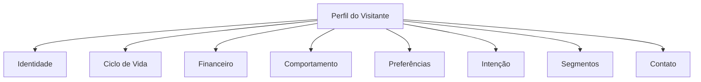

A ontologia é a forma como a UserIn organiza **todos os dados** que conhece sobre cada visitante do seu site. Pense nela como a ficha completa de cada pessoa: quem é, o que fez, quanto gastou, quando acessa e o que provavelmente vai fazer a seguir.

  Você não precisa entender os detalhes técnicos da ontologia para usar a plataforma. Mas conhecer como os dados são organizados vai te ajudar a criar regras, segmentos e automações mais eficientes.

## Como os dados são organizados

Cada visitante tem um **perfil** que acumula informações ao longo do tempo. Esses dados são organizados em **grupos** temáticos:

<AccordionGroup>
  <Accordion title="Identidade" icon="user">
    Dados que identificam o visitante: ID externo, visitor ID, data do primeiro acesso. Esses campos são preenchidos automaticamente pelo tracker e pela integração com seu sistema.
  </Accordion>

  <Accordion title="Ciclo de Vida" icon="arrows-spin">
    O **estágio** atual do visitante na jornada de cliente:
    - **Anônimo**: visitou o site mas ainda não se identificou
    - **Registrado**: criou conta ou se identificou
    - **FTD**: fez a primeira compra/transação
    - **Recorrente**: fez mais de uma compra/transação
  </Accordion>

  <Accordion title="Financeiro" icon="dollar-sign">
    Tudo sobre transações: total gasto, quantidade de compras, ticket médio, valor da primeira compra, tendência de gastos (aumentando, estável ou diminuindo) e classificação por faixa de valor.
  </Accordion>

  <Accordion title="Comportamento" icon="chart-line">
    Como o visitante interage com seu site: total de sessões, duração média, frequência semanal, quantidade de dispositivos usados e páginas visitadas.
  </Accordion>

  <Accordion title="Preferências" icon="heart">
    O que o visitante mais acessa: páginas mais visitadas, categorias preferidas e padrões de navegação. Os campos de preferência variam conforme a categoria do seu negócio.
  </Accordion>

  <Accordion title="Intenção" icon="crosshairs">
    A probabilidade de o visitante converter (fazer uma compra, se registrar, etc.). Calculada automaticamente pela IA da UserIn com base no comportamento, engajamento e recência.
  </Accordion>

  <Accordion title="Segmentos" icon="users-viewfinder">
    Rótulos dinâmicos aplicados ao visitante pelas suas regras e automações. Por exemplo: "VIP", "carrinho_abandonado", "risco_churn". Você controla quais segmentos existem e as condições para entrar ou sair deles.
  </Accordion>

  <Accordion title="Contato" icon="address-book">
    Informações de contato capturadas: nome, email, telefone. Usadas para personalização de mensagens e campanhas.
  </Accordion>
</AccordionGroup>

## Os 4 tipos de dados

Nem todos os campos são iguais. A UserIn classifica cada dado do perfil em 4 categorias:

<CardGroup cols={2}>
  <Card title="Atributos" icon="database">
    **Fatos imutáveis.** Dados que não mudam depois de registrados. Exemplo: data do primeiro acesso, valor da primeira compra, email.
  </Card>
  <Card title="Agregados" icon="calculator">
    **Totais e médias.** Números que a plataforma calcula automaticamente somando eventos. Exemplo: total gasto, quantidade de sessões, ticket médio.
  </Card>
  <Card title="Sinais" icon="signal">
    **Interpretações inteligentes.** Derivados dos dados brutos usando janelas temporais e regras. Exemplo: tendência de gastos (aumentando/diminuindo), melhor horário para contato, classificação por tier.
  </Card>
  <Card title="Outputs" icon="brain">
    **Resultados de IA.** Valores calculados por modelos que combinam múltiplos sinais. Exemplo: score de intenção (0-100), nível de intenção (alto/médio/baixo), próximo passo recomendado.
  </Card>
</CardGroup>

<Tip>
  **Na prática**, você não precisa se preocupar com essas categorias ao criar regras. Todos os campos aparecem juntos no construtor de condições. Mas é útil saber que um "Score de Intenção" (output) é mais sofisticado que um simples "Total Gasto" (agregado).
</Tip>

## Campos por categoria de negócio

A UserIn adapta os campos disponíveis ao tipo de negócio da sua empresa (definido em **Configuração da Empresa**). Alguns campos são **universais** e outros são **específicos** da sua categoria.

### Campos universais

Disponíveis para todas as empresas, independente da categoria:

| Grupo | Exemplos |
|-------|----------|
| Ciclo de Vida | Estágio (anônimo, registrado, FTD, recorrente) |
| Financeiro | Total gasto, quantidade de compras, ticket médio, tendência |
| Comportamento | Sessões por semana, duração média, dispositivos |
| Intenção | Score de intenção, nível de intenção |
| Segmentos | Qualquer segmento que você criar |
| Contato | Nome, email, telefone |

### Campos específicos por categoria

Dependendo da categoria selecionada, campos adicionais ficam disponíveis. Exemplo para **E-commerce**:

| Grupo | Exemplos |
|-------|----------|
| Carrinho | Valor do carrinho, itens, abandono |
| Produtos | Produto favorito, categoria preferida |
| Pedidos | Último pedido, frequência de compra |

  Os campos específicos da sua categoria aparecem automaticamente na ontologia após a configuração da empresa.

## Campos customizados

Além dos campos do sistema, você pode **criar seus próprios campos** na plataforma:

<Steps>
  <Step title="Acesse Estrutura de automações no menu lateral">
    Clique em **Estrutura de automações** para ver a ontologia completa da sua empresa.
  </Step>
  <Step title="Abra o Painel de Ontologia">
    Na aba **Painel de Ontologia**, veja todos os campos disponíveis organizados por grupo. Cada campo mostra seu tipo, descrição e se pode ser usado em regras.
  </Step>
  <Step title="Crie campos customizados">
    Clique em **Novo Campo** para adicionar campos específicos do seu negócio. Escolha o tipo de dado (texto, número, sim/não, lista) e o grupo.
  </Step>
</Steps>

  Campos customizados precisam ser preenchidos via integração (API ou tracker). Eles não são calculados automaticamente como os sinais e outputs do sistema.

## Onde a ontologia aparece na plataforma

Você vai encontrar os campos da ontologia em vários lugares:

<CardGroup cols={2}>
  <Card title="Regras e Condições" icon="code-branch">
    Ao criar uma regra no Editor de Fluxos ou na página de Regras, os campos aparecem como opções de condição. Ex: "Se *deposits.total* é maior que 500".
  </Card>
  <Card title="Personalização de Templates" icon="wand-magic-sparkles">
    Use variáveis como `{{contact.firstName}}` ou `{{deposits.total}}` em Smart Modals, Smart Blocks, emails e SMS para personalizar conteúdo.
  </Card>
  <Card title="Segmentos" icon="users">
    Defina regras de segmentação usando qualquer campo do perfil. Visitantes são classificados automaticamente em tempo real.
  </Card>
  <Card title="Analytics e Insights" icon="chart-bar">
    Veja distribuições e tendências dos campos no dashboard de analytics.
  </Card>
</CardGroup>

## Próximos passos

<CardGroup cols={2}>
  <Card title="Campos e Atributos" icon="table-list" href="/plataforma/campos-e-atributos">
    Lista completa de campos disponíveis e como usá-los em regras.
  </Card>
  <Card title="Sinais e Outputs" icon="brain" href="/plataforma/sinais-e-outputs">
    Como a plataforma gera insights automáticos a partir dos dados brutos.
  </Card>
</CardGroup>
