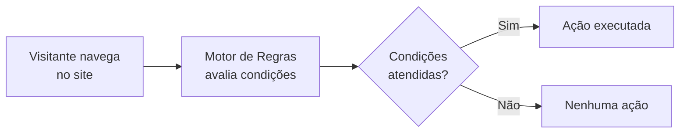
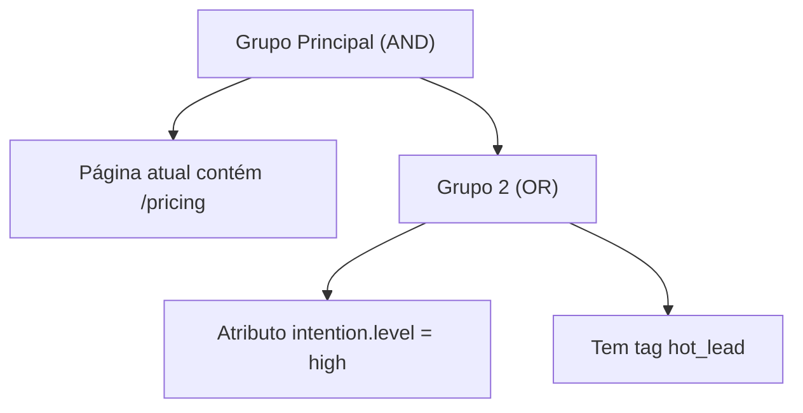

**Nesta página:**

- [O que são Regras](#o-que-são-regras)
- [Criando uma regra](#criando-uma-regra)
- [Condições](#condições)
- [Tipos de condição](#tipos-de-condição)
- [Operadores](#operadores)
- [Grupos de condições (AND / OR)](#grupos-de-condições-and--or)
- [Ações](#ações)
- [Gerador de Regras com IA](#gerador-de-regras-com-ia)
- [Templates e Bibliotecas](#templates-e-bibliotecas)
- [Regras Gerais](#regras-gerais)
- [Onde regras são usadas](#onde-regras-são-usadas)
- [Boas práticas](#boas-práticas)

---

## O que são Regras

Regras são o **motor de decisão** da UserIn. Cada regra define um conjunto de condições comportamentais que, quando atendidas por um visitante, disparam ações automaticamente.

Regras operam em **tempo real**: a cada página visitada, clique ou evento, o motor reavalia todas as regras ativas e executa as ações correspondentes.

<CardGroup cols={3}>
  <Card title="Condições" icon="filter">
    Definem **quando** a regra dispara. Página visitada, clique em elemento, atributo do perfil, tag associada.
  </Card>
  <Card title="Ações" icon="play">
    Definem **o que acontece**. Executar JavaScript, exibir componentes (modais, smart blocks, minigames).
  </Card>
  <Card title="Frequência" icon="clock">
    Definem **quantas vezes** a regra dispara. Uma vez por sessão, uma vez por página ou sempre.
  </Card>
</CardGroup>

  Regras são avaliadas independentemente das jornadas. Uma regra pode acionar componentes diretamente, sem depender do Construtor de Fluxos. Use regras para personalizações pontuais e rápidas. Use jornadas para automações com múltiplos passos.

---

## Criando uma regra

<Steps>
  <Step title="Acesse a seção Regras">
    No menu lateral da plataforma, clique em **Regras**. Você verá a lista de regras existentes com nome, tipo, status e datas.
  </Step>

  <Step title="Clique em Criar Regra">
    O construtor de regras abre com o formulário de metadados e a área de condições.
  </Step>

  <Step title="Preencha os metadados">
    Configure as informações básicas da regra:

    | Campo | Obrigatório | Descrição |
    |-------|-------------|-----------|
    | **Nome** | Sim | Identificador da regra (ex: "Alta intenção - Página de preços") |
    | **Descrição** | Não | Texto livre para documentar o objetivo |
    | **Status** | Sim | Ativa ou Desativada |
    | **Tempo (s)** | Não | Delay em segundos antes de executar a ação |
    | **Frequência** | Não | Controla quantas vezes a regra dispara por visitante |

    Opções de frequência:

    | Frequência | Comportamento |
    |------------|--------------|
    | **Uma vez por sessão** | Dispara no máximo uma vez durante a sessão do visitante |
    | **Uma vez por página** | Dispara no máximo uma vez por carregamento de página |
  </Step>

  <Step title="Configure as condições">
    Adicione uma ou mais condições que o visitante deve atender para a regra disparar. Condições são detalhadas na próxima seção.
  </Step>

  <Step title="Configure a ação">
    Defina o que acontece quando as condições são atendidas: executar JavaScript ou exibir componentes.
  </Step>

  <Step title="Salve e ative">
    Ao salvar com status "Ativa", a regra começa a ser avaliada imediatamente para todos os visitantes.
  </Step>
</Steps>

---

## Condições

Condições definem **quando** a regra dispara. Cada condição é composta por um tipo, um campo opcional, um operador e um valor.

### Tipos de condição

As condições são organizadas em três grupos:

<Tabs>
  <Tab title="Página">
    Condições baseadas nas **URLs** que o visitante acessa.

    | Condição | O que avalia |
    |----------|-------------|
    | **Página atual** | URL da página onde o visitante está agora |
    | **Página visitada** | Qualquer página visitada durante a sessão |
    | **Última página** | URL da página anterior (referrer dentro do site) |

    **Exemplo:** disparar quando a página atual contém `/pricing` (visitante está na página de preços).
  </Tab>

  <Tab title="Interação">
    Condições baseadas em **ações do visitante** na página.

    | Condição | O que avalia |
    |----------|-------------|
    | **Clicou** | Clique em um elemento específico (via seletor CSS ou texto) |
    | **Elemento visível** | Um elemento específico está visível na página (via seletor CSS) |
    | **Acesso** | Estado de autenticação do visitante (logado ou não) |

    **Exemplo:** disparar quando o visitante clica em um botão com a classe `.btn-signup`.
  </Tab>

  <Tab title="Perfil">
    Condições baseadas em **dados do perfil** do visitante.

    | Condição | O que avalia |
    |----------|-------------|
    | **Atributo de Perfil** | Valor de um campo do perfil do visitante |
    | **Tem Tag** | Se o visitante possui um segmento/tag específico |

    **Exemplo:** disparar quando o atributo `intention.level` é igual a `high` e o visitante tem a tag `new_user`.
  </Tab>
</Tabs>

### Operadores

Cada condição usa um operador para definir como o valor é comparado:

<Tabs>
  <Tab title="Operadores gerais">
    | Operador | Descrição |
    |----------|-----------|
    | **É igual a** | Valor exato |
    | **Diferente** | Qualquer valor exceto o especificado |
    | **Contém** | Texto contém a substring |
    | **Não contém** | Texto não contém a substring |
    | **Maior que** | Acima do valor (numérico) |
    | **Menor que** | Abaixo do valor (numérico) |
    | **Existe** | Campo tem algum valor |
    | **Não existe** | Campo está vazio |
    | **Começa com** | Texto inicia com a substring |
    | **Termina com** | Texto finaliza com a substring |
  </Tab>

  <Tab title="Operadores de página">
    | Operador | Descrição |
    |----------|-----------|
    | **É igual à URL** | URL exata |
    | **Contém na URL** | URL contém a substring |
    | **Qualquer URL** | Qualquer página (sem filtro) |
  </Tab>

  <Tab title="Operadores de email">
    | Operador | Descrição |
    |----------|-----------|
    | **Abriu** | Visitante abriu o email |
    | **Clicou** | Visitante clicou em um link do email |
  </Tab>
</Tabs>

### Grupos de condições (AND / OR)

Condições são organizadas em **grupos** com operadores lógicos:

- **AND (E):** todas as condições do grupo devem ser verdadeiras
- **OR (OU):** pelo menos uma condição do grupo deve ser verdadeira

Grupos podem ser aninhados para criar lógicas complexas:

Neste exemplo, a regra dispara quando o visitante está na página de preços **E** (tem intenção alta **OU** tem a tag hot_lead).

<Tip>
  Use o botão **Adicionar Condição** para adicionar condições ao grupo atual, e **Adicionar Grupo** para criar uma nova ramificação lógica. Cada grupo exibe um contador com o total de condições.
</Tip>

---

## Ações

Quando as condições são atendidas, a regra executa uma **ação**. Existem dois tipos:

<CardGroup cols={2}>
  <Card title="Executar JavaScript" icon="terminal">
    Executa um script personalizado no navegador do visitante. Útil para integrações, manipulação de DOM, disparo de eventos em ferramentas de terceiros ou lógica customizada.

    O campo **Ação JS** aceita qualquer código JavaScript válido.
  </Card>
  <Card title="Exibir Componentes" icon="puzzle-piece">
    Vincula a regra a componentes visuais (Smart Modals, Smart Blocks, Minigames). Quando a regra dispara, os componentes vinculados são exibidos ao visitante.

    Componentes são vinculados na tela de edição da regra.
  </Card>
</CardGroup>

O campo **Tempo (s)** permite adicionar um delay antes da execução da ação. Exemplo: configurar 5 segundos para que o componente apareça após o visitante atender às condições, em vez de aparecer instantaneamente.

---

## Gerador de Regras com IA

Descreva a regra em linguagem natural e a IA monta as condições automaticamente.

<Steps>
  <Step title="Clique em Gerar com IA">
    Na lista de regras, clique no botão **Gerar com IA**.
  </Step>
  <Step title="Descreva a regra">
    Escreva em português o que a regra deve fazer. Seja específico sobre condições, páginas e perfil do visitante.
  </Step>
  <Step title="Revise e ajuste">
    A IA gera as condições e metadados. Você é redirecionado para o construtor, onde pode ajustar qualquer detalhe antes de salvar.
  </Step>
</Steps>

**Exemplos de prompts:**

| Prompt | O que a IA gera |
|--------|----------------|
| "Quando o visitante acessar a página de preços e estiver logado" | Condição de página + condição de acesso |
| "Visitante com tag VIP que clicou no botão de compra" | Condição de tag + condição de clique |
| "Qualquer página visitada que contenha /produto e atributo plano igual a free" | Condição de URL + condição de perfil |

---

## Templates e Bibliotecas

Templates permitem **reutilizar regras** entre projetos e equipes. Uma regra marcada como template pode ser vinculada a bibliotecas e distribuída para outras empresas na plataforma.

### Criando um template

No formulário da regra, ative o switch **Template** nas configurações. A regra passa a aparecer na seção **Templates Disponíveis** para as bibliotecas vinculadas.

### Bibliotecas

Bibliotecas agrupam templates de regras. Ao vincular uma regra-template a uma biblioteca, ela fica disponível para todas as empresas associadas àquela biblioteca.

| Conceito | Descrição |
|----------|-----------|
| **Template** | Regra modelo, reutilizável |
| **Biblioteca** | Coleção de templates compartilhada entre empresas |
| **Obrigatória** | Template que não pode ser editado ou desativado pelo destino |
| **Visível** | Template que aparece na lista da empresa destino |

<Steps>
  <Step title="Marque a regra como template">
    Ative o switch **Template** no formulário da regra.
  </Step>
  <Step title="Vincule a bibliotecas">
    Clique em **Vincular a bibliotecas** e selecione as bibliotecas de destino. Para cada uma, defina se o template é **obrigatório** e **visível**.
  </Step>
  <Step title="Distribuição automática">
    Empresas associadas às bibliotecas selecionadas recebem a regra automaticamente. Templates obrigatórios são aplicados sem possibilidade de alteração.
  </Step>
</Steps>

  Templates obrigatórios são identificados pelo badge **Obrigatória** e têm todos os campos bloqueados para edição. Use para regras de compliance ou padrões que devem ser aplicados universalmente.

### Importar e exportar

O construtor de regras suporta importação e exportação em JSON. Use para transferir regras entre ambientes ou criar backups de configurações.

---

## Regras Gerais

Regras Gerais são **guardrails globais** que se aplicam a toda a plataforma. Diferente de regras comportamentais (que disparam ações), Regras Gerais **bloqueiam** ações em contextos específicos.

Uma Regra Geral sempre tem **prioridade** sobre jornadas, regras comportamentais e componentes.

### Bloqueio de páginas

O tipo principal de Regra Geral é o **Bloqueio de Páginas**: impede que componentes sejam exibidos em páginas específicas.

**Quando usar:** para proteger páginas sensíveis onde nenhum componente visual deve aparecer (checkout, formulários críticos, páginas de pagamento).

<Steps>
  <Step title="Acesse Regras Gerais">
    No menu lateral, dentro de **Regras**, clique em **Regras Gerais**.
  </Step>
  <Step title="Crie uma nova Regra Geral">
    Preencha o formulário:

    | Campo | Descrição |
    |-------|-----------|
    | **Nome** | Identificador da regra geral (ex: "Bloquear checkout") |
    | **Descrição** | Texto explicando o objetivo do bloqueio |
    | **Regras de URL** | Padrões de URL onde o bloqueio se aplica |
    | **Bloquear quais componentes?** | Quais tipos de componente são bloqueados |
  </Step>
  <Step title="Configure os padrões de URL">
    Adicione uma ou mais regras de URL com o tipo de correspondência:

    | Tipo | Exemplo | O que bloqueia |
    |------|---------|----------------|
    | **Contém** | `/checkout` | Qualquer URL que contenha `/checkout` |
    | **Começa com** | `/payment/` | URLs que iniciam com `/payment/` |
    | **Termina com** | `/confirm` | URLs que terminam com `/confirm` |
    | **Igual a** | `/deposit` | Apenas a URL exata `/deposit` |
    | **Regex** | `^/cart/[0-9]+$` | URLs que correspondem à expressão regular |
  </Step>
  <Step title="Selecione os componentes bloqueados">
    Escolha quais tipos de componente a regra bloqueia:

    | Componente | Descrição |
    |------------|-----------|
    | **Smart Modals** | Todos os modais |
    | **Minigames** | Todos os minigames |
    | **Smart Blocks** | Todos os blocos injetados |

    Selecione todos para um bloqueio completo, ou apenas tipos específicos.
  </Step>
  <Step title="Ative a regra">
    Regras Gerais inativas não têm efeito. Ative para que o bloqueio entre em vigor imediatamente.
  </Step>
</Steps>

<Tip>
  Crie uma Regra Geral para páginas de pagamento e checkout desde o início. Componentes visuais nessas páginas podem distrair o visitante e prejudicar a conversão.
</Tip>

---

## Onde regras são usadas

Regras alimentam diversas partes da plataforma:

<AccordionGroup>
  <Accordion title="Gatilho de jornada" icon="bolt" defaultOpen>
    No Construtor de Fluxos, o gatilho **Regra da Plataforma** inicia uma jornada quando o visitante atende aos critérios de uma regra. A regra identifica o momento, e a jornada define o que acontece a partir daí.
  </Accordion>

  <Accordion title="Condição em jornada" icon="filter">
    O bloco **Aplicar Regra** no Construtor de Fluxos usa uma regra como filtro intermediário. O fluxo verifica se o visitante atende à regra antes de prosseguir, criando bifurcações personalizadas.
  </Accordion>

  <Accordion title="Ação direta" icon="play">
    Regras podem executar ações diretamente (JavaScript ou componentes) sem depender de uma jornada. Isso é útil para personalizações simples e pontuais.
  </Accordion>

  <Accordion title="Templates para equipes" icon="share-nodes">
    Via bibliotecas, regras-template são distribuídas para múltiplas empresas. Regras obrigatórias garantem padrões de compliance e boas práticas em toda a operação.
  </Accordion>
</AccordionGroup>

---

## Boas práticas

<AccordionGroup>
  <Accordion title="Nomeie regras com padrão descritivo" icon="tag" defaultOpen>
    Use uma convenção clara: **[Contexto] - [Condição principal]**. Exemplos: "Pricing - Visitou 3x na semana", "Checkout - Bloquear modais", "VIP - Exibir oferta exclusiva".
  </Accordion>

  <Accordion title="Use frequência para evitar repetição" icon="clock">
    Configure **Uma vez por sessão** para regras que exibem componentes. Sem essa configuração, o componente pode aparecer a cada carregamento de página, irritando o visitante.
  </Accordion>

  <Accordion title="Adicione delay quando exibir componentes" icon="hourglass">
    Configure o campo **Tempo (s)** com 3 a 5 segundos de delay. Componentes que aparecem instantaneamente no carregamento da página são percebidos como intrusivos.
  </Accordion>

  <Accordion title="Prefira jornadas para fluxos complexos" icon="route">
    Se você precisa de múltiplas ações sequenciais, delays entre etapas ou bifurcações baseadas em comportamento posterior, use uma jornada. Regras são ideais para ações únicas e imediatas.
  </Accordion>

  <Accordion title="Crie Regras Gerais antes de ativar campanhas" icon="shield">
    Antes de lançar jornadas e regras que exibem componentes, garanta que páginas sensíveis (checkout, pagamento, formulários) estejam protegidas por Regras Gerais.
  </Accordion>

  <Accordion title="Teste com o Gerador de IA para prototipar" icon="wand-magic-sparkles">
    Use o Gerador de Regras com IA para criar protótipos rápidos. A IA monta as condições, e você ajusta os detalhes no construtor antes de ativar.
  </Accordion>
</AccordionGroup>

---

## Próximos passos

<CardGroup cols={2}>
  <Card
    title="Jornadas"
    icon="route"
    href="/plataforma/jornadas"
  >
    Use regras como gatilhos e condições no Construtor de Fluxos.
  </Card>
  <Card
    title="Criando Componentes"
    icon="puzzle-piece"
    href="/componentes/criando-componentes"
  >
    Monte os componentes visuais que suas regras vão exibir.
  </Card>
  <Card
    title="Audiência"
    icon="users-viewfinder"
    href="/plataforma/audiencia"
  >
    Gerencie segmentos usados como condições de perfil nas regras.
  </Card>
  <Card
    title="Ontologia de Dados"
    icon="diagram-project"
    href="/plataforma/ontologia"
  >
    Configure os campos de perfil disponíveis nas condições de regra.
  </Card>
</CardGroup>
