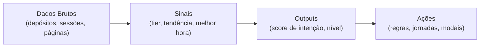

## De dados brutos a insights

A UserIn não mostra apenas números crus. Ela **interpreta** os dados dos seus visitantes automaticamente para gerar insights que facilitam a tomada de decisão.

## Sinais: interpretações inteligentes

Sinais são **derivações** dos dados brutos. Eles respondem perguntas como "esse cliente está gastando mais ou menos?" ou "qual o melhor horário para falar com ele?".

<AccordionGroup>
  <Accordion title="Tier de Depósitos" icon="layer-group">
    Classifica o visitante por faixa de valor total gasto:

    | Tier | Faixa de Valor | Significado |
    |------|---------------|-------------|
    | **None** | R$ 0 | Nunca comprou |
    | **Low** | R$ 1 - R$ 100 | Comprador inicial |
    | **Medium** | R$ 100 - R$ 500 | Comprador moderado |
    | **High** | R$ 500 - R$ 2.000 | Comprador de alto valor |
    | **Whale** | R$ 2.000+ | Comprador premium |

    **Atualizado:** em tempo real, a cada nova transação.

    **Exemplo de uso:** Exibir modal VIP automaticamente quando o tier mudar para "High" ou "Whale".
  </Accordion>

  <Accordion title="Tendência de Depósitos" icon="chart-line">
    Analisa se os gastos do visitante estão subindo, estáveis ou caindo nas últimas semanas:

    | Tendência | Significado |
    |-----------|-------------|
    | **Aumentando** | Gastando mais que o habitual |
    | **Estável** | Mantendo o padrão |
    | **Diminuindo** | Gastando menos que o habitual |

    **Atualizado:** semanalmente, analisando as últimas 5 semanas.

    **Exemplo de uso:** Se a tendência é "Diminuindo" e o tier é "High", disparar campanha de retenção.
  </Accordion>

  <Accordion title="Melhor Horário de Contato" icon="clock">
    Calcula automaticamente a hora do dia e o dia da semana em que o visitante mais acessa seu site:

    - **Melhor Hora:** 0-23 (ex: 14 = 14h)
    - **Melhor Dia:** Domingo a Sábado

    **Atualizado:** diariamente, analisando o histórico de sessões.

    **Exemplo de uso:** Agendar envio de SMS promocional no horário em que o visitante está mais ativo.
  </Accordion>

  <Accordion title="Dias Desde Último Depósito" icon="calendar-days">
    Conta automaticamente quantos dias se passaram desde a última transação. Aumenta a cada dia que passa sem compra.

    **Atualizado:** em tempo real (calculado dinamicamente).

    **Exemplo de uso:** Se dias desde último depósito é maior que 30, adicionar tag "inativo" e iniciar jornada de reativação.
  </Accordion>

  <Accordion title="Variação de Saldo na Sessão (iGaming)" icon="arrow-trend-down">
    Para plataformas de jogos, monitora quanto o visitante ganhou ou perdeu na sessão atual:

    - **Valor (R$):** diferença entre saldo atual e inicial
    - **Percentual (%):** variação relativa

    **Atualizado:** em tempo real durante a sessão.

    **Exemplo de uso:** Se perdeu mais de 50% do saldo, exibir modal sugerindo pausar o jogo.
  </Accordion>
</AccordionGroup>

## Outputs: resultados de IA

Outputs são o nível mais sofisticado de análise. Eles combinam **múltiplos sinais e dados** usando modelos de inteligência artificial para produzir uma avaliação final.

### Score de Intenção

O output principal da UserIn. Um número de **0 a 100** que representa a probabilidade do visitante converter (fazer uma compra, se registrar, etc.).

<CardGroup cols={3}>
  <Card title="0-39: Baixa" icon="circle-arrow-down">
    Visitante casual ou desinteressado. Poucas sessões, pouco engajamento.
  </Card>
  <Card title="40-69: Média" icon="circle-arrow-right">
    Demonstra interesse mas ainda não decidiu. Visitando páginas relevantes com alguma frequência.
  </Card>
  <Card title="70-100: Alta" icon="circle-arrow-up">
    Alta probabilidade de converter. Engajamento consistente, múltiplas sessões, explorando conteúdo de conversão.
  </Card>
</CardGroup>

#### Como é calculado?

O score considera automaticamente:

| Fator | Peso | Exemplo |
|-------|------|---------|
| **Estágio do visitante** | Alto | Registrado vale mais que anônimo |
| **Sessões por semana** | Médio | Mais sessões = mais interesse |
| **Duração das sessões** | Médio | Visitas longas indicam engajamento |
| **Páginas visitadas** | Médio | Diversidade de páginas exploradas |
| **Recência** | Alto | Visita recente vale mais |

<Info>
  O Score de Intenção é recalculado **diariamente** para cada visitante ativo. Visitantes sem sessão recente vão perdendo score gradualmente.
</Info>

### Nível de Intenção

Versão simplificada do score, em 3 categorias:

| Nível | Score | Uso recomendado |
|-------|-------|-----------------|
| **Alto** | 70-100 | Prioridade máxima. Ofereça conversão imediata. |
| **Médio** | 40-69 | Nutra com conteúdo relevante. |
| **Baixo** | 0-39 | Evite comunicação agressiva. |

### Próximo Passo (Next Step)

Uma recomendação textual gerada pela IA sobre qual ação tomar com o visitante. Exemplos:

- *"Oferecer bônus de primeiro depósito"*
- *"Enviar lembrete de carrinho abandonado"*
- *"Apresentar programa VIP"*
- *"Risco de churn — ativar retenção"*

## Sinais customizados

Além dos sinais do sistema, você pode **criar seus próprios sinais** na página de Ontologia:

<Steps>
  <Step title="Acesse Objetos no menu lateral">
    Navegue até a seção de Ontologia.
  </Step>
  <Step title="Crie um novo Sinal">
    Defina o nome, tipo de resultado (sim/não, número, texto, lista) e a fórmula de cálculo.
  </Step>
  <Step title="Defina as condições">
    Configure a lógica usando os campos existentes. Por exemplo: "Se deposits.total > 1000 E deposits.trend = diminuindo, então vip_decline_flag = verdadeiro".
  </Step>
  <Step title="Ative o sinal">
    Após salvar, o sinal será calculado automaticamente para todos os visitantes da sua empresa.
  </Step>
</Steps>

### Exemplo: Sinal de Declínio VIP

Um sinal customizado que identifica clientes VIP que estão diminuindo gastos:

| Propriedade | Valor |
|-------------|-------|
| **Nome** | vip_decline_flag |
| **Tipo** | Sim/Não (boolean) |
| **Condição** | deposits.total > 1000 E deposits.trend = diminuindo |
| **Uso** | Disparar jornada de retenção VIP |

<Warning>
  Sinais customizados dependem dos campos que você usar como base. Certifique-se de que os dados estão sendo preenchidos via integração antes de criar sinais que dependam deles.
</Warning>

## Como usar sinais e outputs em regras

Sinais e outputs aparecem como campos normais no construtor de condições. Alguns exemplos práticos:

<AccordionGroup>
  <Accordion title="Converter visitantes de alta intenção" icon="bullseye">
    **Condição:** Score de Intenção *maior que* 70 **E** Estágio *igual a* Anônimo

    **Ação:** Exibir Smart Modal com formulário de cadastro e oferta especial.
  </Accordion>

  <Accordion title="Prevenir churn de clientes valiosos" icon="shield">
    **Condição:** Tier *igual a* High **E** Tendência *igual a* Diminuindo **E** Dias Desde Último Depósito *maior que* 14

    **Ação:** Iniciar jornada de retenção com SMS + email + modal personalizado.
  </Accordion>

  <Accordion title="Gamificação responsável (iGaming)" icon="gamepad">
    **Condição:** Variação de Saldo *menor que* -50%

    **Ação:** Exibir Smart Modal sugerindo pausa e limites de depósito.
  </Accordion>
</AccordionGroup>

## Próximos passos

<CardGroup cols={2}>
  <Card title="Personalização com Liquid" icon="arrow-right" href="/plataforma/personalizacao-liquid">
    Use os campos do perfil para personalizar mensagens em modais, emails e SMS.
  </Card>
  <Card title="Ontologia de Dados" icon="arrow-left" href="/plataforma/ontologia">
    Voltar à visão geral de como os dados são organizados.
  </Card>
</CardGroup>
