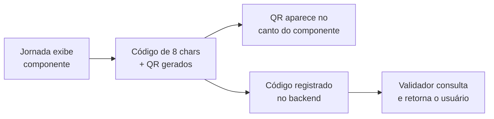

**Nesta página:**

- [O que é o Validador de Premiação](#o-que-é-o-validador-de-premiação)
- [Como o código de verificação funciona](#como-o-código-de-verificação-funciona)
- [Verificando por código](#verificando-por-código)
- [Verificando por imagem (QR)](#verificando-por-imagem-qr)
- [Interpretando o resultado](#interpretando-o-resultado)
- [Cenários de resultado](#cenários-de-resultado)
- [Onde o QR aparece](#onde-o-qr-aparece)
- [Acesso público via link direto](#acesso-público-via-link-direto)
- [Boas práticas](#boas-práticas)

---

## O que é o Validador de Premiação

<Frame caption="Validador de Premiação: digite o código ou escaneie o QR para identificar o usuário">
  
</Frame>

O Validador de Premiação permite identificar **qual usuário recebeu um componente específico** da UserIn. Toda vez que um Smart Modal, Smart Block ou Minigame é exibido para um visitante, a plataforma gera um código único e um QR code vinculados àquela exibição.

Com o Validador, sua equipe pode escanear ou digitar esse código para consultar instantaneamente quem recebeu o componente, em qual jornada e em que momento.

<CardGroup cols={2}>
  <Card title="Verificação por código" icon="keyboard">
    Digite o código de 8 caracteres exibido no componente e clique em **Verificar**.
  </Card>
  <Card title="Verificação por imagem" icon="image">
    Faça upload de um print ou foto do componente e clique diretamente sobre o QR code na imagem.
  </Card>
</CardGroup>

<div className="callout-blue">
  O Validador é essencial para cenários de premiação presencial. Quando um visitante apresenta um componente (print ou tela) alegando ter recebido uma oferta ou prêmio, sua equipe pode confirmar a autenticidade em segundos.
</div>

---

## Como o código de verificação funciona

O código é gerado automaticamente pela plataforma a cada exibição de componente. Não é necessário configurar nada: o processo é transparente.



| Etapa | O que acontece |
|-------|---------------|
| **1. Exibição** | Uma jornada aciona um componente (Smart Modal, Smart Block ou Minigame) para o visitante |
| **2. Geração** | A plataforma gera um código alfanumérico de 8 caracteres e o codifica em um QR code |
| **3. Registro** | O código é enviado ao backend junto com o contexto: usuário, componente, jornada e página |
| **4. Exibição do QR** | O QR code e o código aparecem no canto inferior direito do componente, visíveis ao visitante |
| **5. Consulta** | Qualquer pessoa com acesso ao Validador pode digitar o código ou escanear o QR para consultar os dados |

Cada código é **único por exibição**. Se o mesmo componente for exibido para o mesmo visitante em momentos diferentes, cada exibição gera um código distinto.

---

## Verificando por código

A forma mais direta de validar. Use quando o visitante informar o código verbalmente ou por texto.

<Steps>
  <Step title="Acesse o Validador de Premiação">
    No menu lateral da plataforma, clique em **Validador de Premiação**.
  </Step>
  <Step title="Digite o código">
    No campo **Código de verificação**, insira o código de 8 caracteres (ex: `Ab3kX9mN`). O código não diferencia maiúsculas de minúsculas.
  </Step>
  <Step title="Clique em Verificar">
    A plataforma consulta o código e retorna os dados do usuário e do componente associados.
  </Step>
</Steps>

---

## Verificando por imagem (QR)

Use quando o visitante apresentar um print de tela ou foto do componente.

<Steps>
  <Step title="Faça upload da imagem">
    Arraste uma foto ou print para a área de upload, ou clique para selecionar o arquivo.
  </Step>
  <Step title="Clique sobre o QR code">
    Com a imagem carregada, clique diretamente sobre o QR code na imagem. Ele geralmente está no **canto inferior direito** do componente.
  </Step>
  <Step title="Aguarde a leitura">
    A plataforma decodifica o QR, extrai o código e consulta automaticamente. O resultado aparece na mesma tela.
  </Step>
</Steps>

<Tip>
  Aponte o clique no centro do QR code para melhor precisão. Se a leitura falhar, tente clicar novamente ou use o código de texto que aparece ao lado do QR.
</Tip>

---

## Interpretando o resultado

Quando a verificação é bem-sucedida, o Validador retorna duas categorias de informação:

<Tabs>
  <Tab title="Dados do usuário">
    Informações sobre quem recebeu o componente:

    | Campo | Descrição |
    |-------|-----------|
    | **ID** | Identificador do usuário (External ID ou ID Local) |
    | **Tipo de ID** | Se é um External ID (identificado) ou LocalStorage ID (anônimo) |
    | **Estágio** | Fase no funil (Anônimo, Registrado, FTD, MTD) |
    | **Segmentos** | Segmentos ativos do usuário no momento da consulta |
    | **Depósitos** | Dados financeiros (total, contagem, tier) |
    | **Comportamento** | Métricas de engajamento |
    | **Última atualização** | Data/hora da última atividade registrada |

    Se o usuário está sincronizado com a plataforma, o botão **Abrir Perfil Completo** leva diretamente ao Relatório de Usuários com o perfil detalhado.
  </Tab>

  <Tab title="Dados do componente">
    Contexto da exibição que gerou o código:

    | Campo | Descrição |
    |-------|-----------|
    | **Componente** | Tipo e nome (Smart Modal, Smart Block ou Minigame) |
    | **Jornada** | Nome da jornada que acionou a exibição |
    | **Página** | URL da página onde o componente foi exibido |
    | **Data** | Data e hora da exibição |
    | **Código** | O código de verificação consultado |
  </Tab>
</Tabs>

---

## Cenários de resultado

<AccordionGroup>
  <Accordion title="Usuário encontrado" icon="circle-check" defaultOpen>
    O código é válido e o usuário está sincronizado com a plataforma. Todos os dados são exibidos, incluindo perfil, segmentos e comportamento.

    O badge **Válido** aparece ao lado do código, e o badge **Encontrado** ao lado do usuário. O botão **Abrir Perfil Completo** fica disponível.
  </Accordion>

  <Accordion title="Código válido, usuário não sincronizado" icon="circle-exclamation">
    O código existe no sistema, mas o usuário ainda não foi sincronizado com a plataforma UserIn. Isso pode acontecer quando o visitante interagiu com o componente mas seus dados ainda não foram processados.

    A plataforma exibe o ID do usuário e sugere que você procure na sua fonte de dados original usando o External ID ou ID Local fornecido.
  </Accordion>

  <Accordion title="Código não encontrado" icon="circle-xmark">
    O código digitado não existe no sistema. Possíveis causas:

    - Código digitado incorretamente (verifique caracteres similares como `0/O`, `1/l`)
    - Código expirado ou de outro ambiente
    - Código inventado (tentativa de fraude)
  </Accordion>

  <Accordion title="QR não encontrado na imagem" icon="image">
    A leitura do QR falhou na região clicada. Tente:

    - Clicar mais próximo ao centro do QR code
    - Usar uma imagem com melhor resolução
    - Digitar o código de texto manualmente (aparece ao lado do QR no componente)
  </Accordion>
</AccordionGroup>

---

## Onde o QR aparece

O código de verificação e o QR são exibidos automaticamente nos três tipos de componentes visuais da plataforma:

| Componente | Localização do QR |
|------------|------------------|
| **Smart Modal** | Canto inferior direito da janela do modal |
| **Smart Block** | Canto inferior direito do bloco injetado na página |
| **Minigame** | Canto inferior direito da interface do jogo (roleta, raspadinha, etc.) |

O QR é pequeno e discreto para não interferir na experiência do visitante, mas visível o suficiente para ser capturado em um print de tela.

<div className="callout-blue">
  O QR e o código são gerados automaticamente para todos os componentes exibidos via jornada. Não é necessário ativar ou configurar nada: basta ter uma jornada ativa com ação de exibição de componente.
</div>

---

## Acesso público via link direto

Além do acesso pela plataforma, o Validador possui uma **rota pública** que funciona sem autenticação:

```
https://app.userin.ai/verify/{código}
```

Isso permite que equipes externas (atendimento presencial, parceiros) validem códigos diretamente pelo link, sem precisar de login na plataforma. Basta compartilhar o link com o código preenchido.

<Note>
  A rota pública retorna apenas os dados de verificação. Para acessar o perfil completo do usuário e funcionalidades avançadas, é necessário login na plataforma.
</Note>

---

## Boas práticas

<AccordionGroup>
  <Accordion title="Oriente sua equipe sobre o fluxo de validação" icon="users" defaultOpen>
    Treine os times de atendimento e operação para usar o Validador sempre que um visitante alegar ter recebido uma oferta ou prêmio. O processo leva segundos e elimina fraudes.
  </Accordion>

  <Accordion title="Prefira o código de texto ao QR em atendimento remoto" icon="keyboard">
    Em atendimento por chat ou telefone, peça ao visitante o código de 8 caracteres. É mais rápido e confiável do que pedir uma foto do QR.
  </Accordion>

  <Accordion title="Use a rota pública para equipes sem acesso à plataforma" icon="link">
    Compartilhe o formato do link direto (`/verify/{código}`) com equipes que precisam validar mas não têm conta na UserIn. Funciona sem login.
  </Accordion>

  <Accordion title="Verifique a data da exibição" icon="calendar">
    O resultado mostra quando o componente foi exibido. Use essa informação para confirmar se a oferta ou prêmio ainda está dentro do prazo de validade.
  </Accordion>

  <Accordion title="Consulte o perfil completo quando necessário" icon="user">
    Se o usuário foi encontrado, clique em **Abrir Perfil Completo** para ver o histórico completo de segmentos, jornadas e interações. Isso ajuda a entender o contexto da premiação.
  </Accordion>
</AccordionGroup>

---

## Próximos passos

<CardGroup cols={2}>
  <Card
    title="Jornadas"
    icon="route"
    href="/plataforma/jornadas"
  >
    Configure as automações que exibem componentes e geram códigos de verificação.
  </Card>
  <Card
    title="Criando Componentes"
    icon="puzzle-piece"
    href="/componentes/criando-componentes"
  >
    Monte os Smart Modals, Smart Blocks e Minigames que serão validados.
  </Card>
  <Card
    title="Audiência"
    icon="users-viewfinder"
    href="/plataforma/audiencia"
  >
    Gerencie segmentos e consulte perfis de usuários verificados.
  </Card>
  <Card
    title="Personalização com Variáveis"
    icon="wand-magic-sparkles"
    href="/plataforma/personalizacao-liquid"
  >
    Personalize os componentes com dados do visitante usando variáveis Liquid.
  </Card>
</CardGroup>
