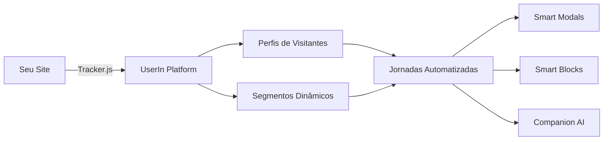

## Como a UserIn funciona

A UserIn é uma plataforma completa de inteligência comportamental. Ela coleta dados do seu site, processa em tempo real e permite que você tome ações automatizadas baseadas no comportamento dos seus visitantes.

## Componentes principais

<AccordionGroup>
  <Accordion title="Tracker" icon="satellite-dish">
    Um script JavaScript leve que você adiciona ao seu site. Ele captura automaticamente:
    - **Page views** — cada página visitada
    - **Cliques** — interações com elementos
    - **Formulários** — dados preenchidos (com controle de privacidade)
    - **Scroll** — profundidade de leitura
    - **Sessões** — tempo no site, páginas por visita
    - **Eventos customizados** — qualquer ação que você queira rastrear
  </Accordion>

  <Accordion title="Perfis de Visitantes" icon="user">
    Cada visitante recebe um perfil único que acumula todo o histórico comportamental. Quando o visitante se identifica (login, formulário, etc.), o perfil anônimo é unificado com os dados reais.
  </Accordion>

  <Accordion title="Segmentos" icon="users">
    Agrupe visitantes automaticamente com base em regras comportamentais. Por exemplo:
    - Visitantes que viram a página de preços mais de 3 vezes
    - Usuários que abandonaram o carrinho nos últimos 7 dias
    - Leads que interagiram com o Companion
  </Accordion>

  <Accordion title="Jornadas (Journey Builder)" icon="route">
    Um editor visual drag-and-drop onde você cria fluxos de automação. Conecte gatilhos, condições e ações para criar experiências personalizadas automaticamente.
  </Accordion>

  <Accordion title="Smart Modals" icon="window-maximize">
    Modais que aparecem com base em regras comportamentais. Totalmente customizáveis com imagens, HTML personalizado e botões de CTA com efeitos.
  </Accordion>

  <Accordion title="Companion (IA)" icon="robot">
    Assistente de IA que conversa com seus visitantes em tempo real, entendendo o contexto da navegação para oferecer ajuda relevante e proativa.
  </Accordion>
</AccordionGroup>

## Fluxo típico de configuração

<Steps>
  <Step title="Instale o Tracker" icon="1">
    Adicione o script ao seu site. [Ver guia de instalação →](/onboarding/instalar-tracker)
  </Step>
  <Step title="Identifique Usuários" icon="2">
    Conecte seus dados de login/cadastro ao tracker. [Ver como conectar →](/onboarding/conectando-dados)
  </Step>
  <Step title="Crie Segmentos" icon="3">
    Defina regras para agrupar visitantes por comportamento.
  </Step>
  <Step title="Monte Jornadas" icon="4">
    Use o Journey Builder para criar automações com Smart Modals, notificações e mais.
  </Step>
  <Step title="Analise Resultados" icon="5">
    Acompanhe métricas de engajamento e converta mais visitantes em clientes.
  </Step>
</Steps>

## Próximo passo

<Card
  title="Primeiros Passos"
  icon="arrow-right"
  href="/onboarding/primeiros-passos"
>
  Comece agora: crie sua conta e instale o tracker em menos de 5 minutos.
</Card>
