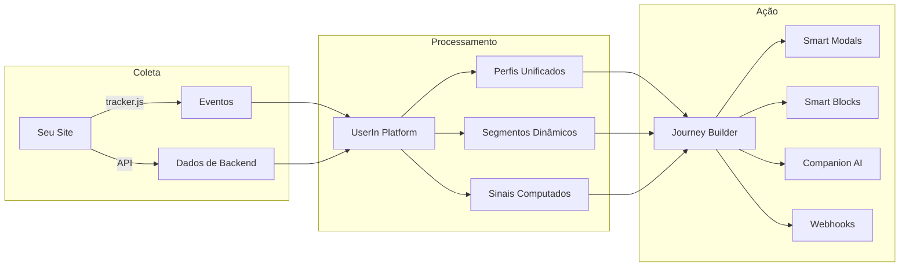

## Arquitetura da Plataforma

A UserIn opera em três camadas: **Coleta**, **Processamento** e **Ação**. Dados fluem do seu site para a plataforma em tempo real, são enriquecidos e transformados em ações automatizadas.


```mermaid
flowchart LR
    subgraph Coleta
        A[Seu Site] -->|tracker.js| B[Eventos]
        A -->|API| C[Dados de Backend]
    end
    
    subgraph Processamento
        B --> D[UserIn Platform]
        C --> D
        D --> E[Perfis Unificados]
        D --> F[Segmentos Dinâmicos]
        D --> G[Sinais Computados]
    end
    
    subgraph Ação
        E --> H[Journey Builder]
        F --> H
        G --> H
        H --> I[Smart Modals]
        H --> J[Smart Blocks]
        H --> K[Companion AI]
        H --> L[Webhooks]
    end
```

---

## Componentes Principais

<AccordionGroup>
  <Accordion title="Tracker JavaScript" icon="satellite-dish" defaultOpen>
    Script leve (~8KB gzipped) que você adiciona ao seu site. Captura automaticamente:
    
    | Evento | Descrição |
    |--------|-----------|
    | `page_view` | Cada página visitada com URL, título e referrer |
    | `click` | Interações com elementos (botões, links, CTAs) |
    | `form_submit` | Dados de formulários com controle de privacidade |
    | `scroll_depth` | Profundidade de leitura (25%, 50%, 75%, 100%) |
    | `session` | Tempo no site, páginas por visita, frequência |
    | `custom` | Qualquer evento que você queira rastrear via API |
    
    <Tip>
      O tracker funciona em SPAs (React, Vue, Next.js) e sites tradicionais sem configuração extra.
    </Tip>
  </Accordion>

  <Accordion title="Perfis de Visitantes" icon="user-circle">
    Todo visitante recebe um **perfil único** que persiste entre sessões. O perfil acumula:
    
    - **Histórico completo** de páginas visitadas
    - **Eventos** e interações realizadas
    - **Atributos** coletados (nome, email, empresa, etc.)
    - **Sinais computados** (lead score, engajamento, etc.)
    - **Segmentos** aos quais pertence
    
    Quando um visitante anônimo se identifica (login, formulário, compra), a UserIn **unifica automaticamente** todo o histórico anônimo com o perfil identificado.
    
    ```javascript
    // Identificar um visitante
    userin.identify('user_123', {
      email: 'joao@empresa.com',
      name: 'João Silva',
      plan: 'enterprise'
    });
    ```
  </Accordion>

  <Accordion title="Segmentos Dinâmicos" icon="users-viewfinder">
    Agrupe visitantes automaticamente com regras comportamentais. Segmentos são **avaliados em tempo real** — quando um visitante muda de comportamento, ele entra ou sai do segmento instantaneamente.
    
    **Exemplos de segmentos:**
    - Visitou `/pricing` mais de 3 vezes nos últimos 7 dias
    - Abandonou carrinho com valor acima de R$ 500
    - Não logou há mais de 30 dias (risco de churn)
    - Completou onboarding mas não usou feature X
    
    <Info>
      Segmentos podem ser usados como gatilhos em Jornadas ou para filtrar dashboards de analytics.
    </Info>
  </Accordion>

  <Accordion title="Ontologia e Campos" icon="diagram-project">
    A Ontologia permite que você **estenda o modelo de dados** da UserIn para seu domínio específico:
    
    - **Campos customizados**: Adicione atributos específicos do seu negócio (cargo, empresa, LTV, etc.)
    - **Objetos**: Crie entidades como Produtos, Pedidos, Assinaturas
    - **Relacionamentos**: Conecte visitantes a objetos (comprou Produto X, pertence à Empresa Y)
    - **Sinais**: Compute métricas derivadas (lead score = f(engajamento, perfil, comportamento))
    
    [Saiba mais sobre Ontologia →](/plataforma/ontologia)
  </Accordion>

  <Accordion title="Journey Builder" icon="route">
    Editor visual **drag-and-drop** para criar automações sofisticadas:
    
    **Gatilhos (Triggers):**
    - Evento ocorreu (page view, clique, form submit)
    - Entrou/saiu de segmento
    - Tempo desde última visita
    - Webhook externo
    
    **Condições:**
    - Verificar atributos do perfil
    - Avaliar regras comportamentais
    - Split A/B para testes
    
    **Ações:**
    - Exibir Smart Modal ou Smart Block
    - Ativar Companion AI
    - Enviar webhook para seu backend
    - Adicionar/remover de segmento
    - Atualizar atributos do perfil
    
    <Warning>
      Jornadas processam eventos em **tempo real**. Um visitante pode entrar em múltiplas jornadas simultaneamente.
    </Warning>
  </Accordion>

  <Accordion title="Smart Modals" icon="window-maximize">
    Modais totalmente customizáveis que aparecem baseados em **regras comportamentais**:
    
    - **Templates prontos** ou HTML/CSS customizado
    - **Gatilhos inteligentes**: scroll, tempo na página, intenção de saída
    - **Frequência controlada**: evite mostrar o mesmo modal repetidamente
    - **Métricas**: impressões, cliques, conversões, receita atribuída
    
    Combine com **personalização Liquid** para exibir conteúdo dinâmico baseado no perfil do visitante.
  </Accordion>

  <Accordion title="Companion AI" icon="message-bot">
    Assistente de IA que **entende o contexto** da navegação do visitante:
    
    - Sabe quais páginas o visitante viu
    - Conhece o histórico de interações
    - Responde perguntas sobre seu produto/serviço
    - Oferece ajuda proativa no momento certo
    - Pode executar ações (capturar lead, agendar demo, etc.)
    
    O Companion é treinado com seu conteúdo e pode ser ativado via Jornadas ou automaticamente.
  </Accordion>
</AccordionGroup>

---

## Fluxo de Implementação

<Steps>
  <Step title="Instalar o Tracker" icon="download">
    Adicione o script ao seu site. Funciona em qualquer stack.
    
    ```html
    <script src="https://cdn.userin.ai/tracker.js" data-key="uk_xxx"></script>
    ```
    
    [Guia completo de instalação →](/onboarding/instalar-tracker)
  </Step>
  
  <Step title="Identificar Usuários" icon="fingerprint">
    Conecte o tracker ao seu sistema de autenticação para unificar perfis.
    
    ```javascript
    // Quando o usuário logar
    userin.identify(user.id, {
      email: user.email,
      name: user.name
    });
    ```
    
    [Como conectar dados →](/onboarding/conectando-dados)
  </Step>
  
  <Step title="Criar Segmentos" icon="layer-group">
    Defina regras para agrupar visitantes por comportamento. Use a interface visual ou a API.
  </Step>
  
  <Step title="Montar Jornadas" icon="sitemap">
    Use o Journey Builder para criar automações. Comece simples: um modal de boas-vindas para novos visitantes.
  </Step>
  
  <Step title="Analisar e Otimizar" icon="chart-line">
    Acompanhe métricas no dashboard. Teste variações. Itere baseado em dados reais.
  </Step>
</Steps>

---

## Arquitetura Técnica

<Tabs>
  <Tab title="Frontend">
    O tracker é um script JavaScript puro, sem dependências. Funciona via:
    - Tag `<script>` tradicional
    - NPM package para SPAs
    - Google Tag Manager
    
    Dados são enviados via HTTPS para nossos endpoints com batching automático para performance.
  </Tab>
  
  <Tab title="Backend">
    Nossa API REST permite:
    - Enviar eventos server-side
    - Criar/atualizar perfis
    - Gerenciar segmentos programaticamente
    - Disparar jornadas via webhook
    
    [Ver API Reference →](/api-reference/introduction)
  </Tab>
  
  <Tab title="Processamento">
    Eventos são processados em **tempo real** (~100ms latência):
    - Avaliação de segmentos
    - Execução de jornadas
    - Computação de sinais
    - Indexação para analytics
  </Tab>
</Tabs>

---

## Próximos Passos

<CardGroup cols={2}>
  <Card
    title="Primeiros Passos"
    icon="play"
    href="/onboarding/primeiros-passos"
  >
    Crie sua conta e configure seu primeiro projeto agora.
  </Card>
  <Card
    title="API Reference"
    icon="code"
    href="/api-reference/introduction"
  >
    Documentação completa da API para integrações avançadas.
  </Card>
</CardGroup>
