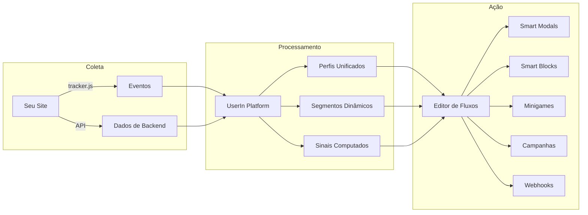

## Como a plataforma funciona

A UserIn opera em três camadas: **Coleta**, **Processamento** e **Ação**. Dados comportamentais fluem do seu site para a plataforma em tempo real, são enriquecidos com perfis e segmentos, e se transformam em automações.


```mermaid
flowchart LR
    subgraph Coleta
        A[Seu Site] -->|tracker.js| B[Eventos]
        A -->|API| C[Dados de Backend]
    end
    
    subgraph Processamento
        B --> D[UserIn Platform]
        C --> D
        D --> E[Perfis Unificados]
        D --> F[Segmentos Dinâmicos]
        D --> G[Sinais Computados]
    end
    
    subgraph Ação
        E --> H[Editor de Fluxos]
        F --> H
        G --> H
        H --> I[Smart Modals]
        H --> J[Smart Blocks]
        H --> K[Minigames]
        H --> L[Campanhas]
        H --> M[Webhooks]
    end
```

---

## O que cada componente faz

<AccordionGroup>
  <Accordion title="Tracker JavaScript" icon="satellite-dish" defaultOpen>
    Script leve (~8KB gzipped) que você adiciona ao seu site. Captura automaticamente os seguintes eventos:
    
    | Evento | Descrição |
    |--------|-----------|
    | `page_view` | Cada página visitada com URL, título e referrer |
    | `click` | Interações com elementos (botões, links, CTAs) |
    | `form_submit` | Dados de formulários com controle de privacidade |
    | `scroll_depth` | Profundidade de leitura (25%, 50%, 75%, 100%) |
    | `session` | Tempo no site, páginas por visita, frequência |
    | `custom` | Qualquer evento que você queira rastrear via API |
    
    <Tip>
      O tracker funciona em SPAs (React, Vue, Next.js) e sites tradicionais sem configuração extra.
    </Tip>
  </Accordion>

  <Accordion title="Perfis de Visitantes" icon="user-circle">
    Todo visitante recebe um **perfil único** que persiste entre sessões. O perfil acumula cinco tipos de informação:
    
    - **Histórico completo** de páginas visitadas
    - **Eventos** e interações realizadas
    - **Atributos** coletados (nome, email, empresa, etc.)
    - **Sinais computados** (lead score, engajamento, etc.)
    - **Segmentos** aos quais pertence
    
    Quando um visitante anônimo se identifica (login, formulário, compra), a UserIn **unifica automaticamente** todo o histórico anônimo com o perfil identificado.
    
    ```javascript
    userin.identify('user_123', {
      email: 'joao@empresa.com',
      name: 'João Silva',
      plan: 'enterprise'
    });
    ```
  </Accordion>

  <Accordion title="Segmentos Dinâmicos" icon="users-viewfinder">
    Agrupe visitantes automaticamente com regras comportamentais. Segmentos são **avaliados em tempo real**. Quando um visitante muda de comportamento, ele entra ou sai do segmento instantaneamente.
    
    Alguns exemplos de segmentos que você pode criar:
    
    - Visitou `/pricing` mais de 3 vezes nos últimos 7 dias
    - Abandonou carrinho com valor acima de R$ 500
    - Não logou há mais de 30 dias (risco de churn)
    - Completou onboarding mas não usou feature X
    
    <Info>
      Segmentos podem ser usados como gatilhos no Editor de Fluxos ou para filtrar dashboards de analytics.
    </Info>
  </Accordion>

  <Accordion title="Regras" icon="list-check">
    Motor de regras que avalia o comportamento dos visitantes e aplica segmentos automaticamente. Existem dois tipos de regras:
    
    - **Regras de intenção**: classificam visitantes com base em padrões de navegação, frequência de visitas e engajamento com o conteúdo
    - **Regras de comportamento**: segmentam visitantes com base em ações transacionais e histórico de interações
    
    Cada regra define uma condição (campo + operador + valor) e uma ação (adicionar ou remover segmento). As regras são avaliadas em tempo real e possuem sistema de prioridade para resolver conflitos.
    
    <Tip>
      Use regras como gatilhos no Editor de Fluxos. Exemplo: quando o visitante recebe o segmento "alta intenção", inicie automaticamente um fluxo de conversão.
    </Tip>
  </Accordion>

  <Accordion title="Ontologia e Campos" icon="diagram-project">
    A Ontologia permite que você **estenda o modelo de dados** da UserIn para seu domínio específico. Ela é composta por quatro elementos:
    
    - **Campos customizados**: atributos específicos do seu negócio (cargo, empresa, LTV, etc.)
    - **Objetos**: entidades como Produtos, Pedidos, Assinaturas
    - **Relacionamentos**: conexões entre visitantes e objetos (comprou Produto X, pertence à Empresa Y)
    - **Sinais**: métricas derivadas (lead score = f(engajamento, perfil, comportamento))
    
    [Saiba mais sobre Ontologia →](/plataforma/ontologia)
  </Accordion>

  <Accordion title="Editor de Fluxos" icon="route">
    Editor visual **drag-and-drop** para criar automações. Um fluxo é composto por seis categorias de blocos:

    **Gatilhos:** definem quando o fluxo é acionado.
    - Regra da plataforma (quando o visitante atende critérios de uma regra)
    - Agendado (horários programados via cron)
    - Trigger manual (via código JavaScript no site)
    - Evento e Webhook (em breve)

    **Condições:** filtram quem avança no fluxo.
    - Verificar se o visitante possui um segmento específico
    - Avaliar atributos do perfil (ex: deposits.count > 5)
    - Aplicar regra da plataforma como condição

    **Ações:** determinam o que acontece. Divididas em três grupos:
    - *Padrão:* adicionar/remover segmento
    - *Insite:* exibir modal, smart block, minigame, injetar HTML, executar JavaScript, enviar evento
    - *Offsite:* enviar SMS, email, push ou chamar webhook

    **Controle de Fluxo:** gerenciam a lógica da automação.
    - Aguardar (delay em minutos, horas ou dias)
    - Caminhos paralelos (executa múltiplas ações simultaneamente)
    - Teste A/B (divide visitantes em variantes aleatórias)
    - Ir para outro fluxo (redireciona para outra automação)
    - Finalizar (encerra o fluxo)

    **Integrações:** conectam com ferramentas externas.
    - Smartico (gamificação e CRM)
    - SendSpeed (mensageria)

    **Rastreamento:** medem a performance do fluxo.
    - Track Event (registra evento customizado)
    - Track Conversion (registra conversão com valor)
    - Journey Init / Journey End (marcam pontos de medição no funil)

    <div className="callout-blue">
      Fluxos processam eventos em **tempo real**. Um visitante pode entrar em múltiplos fluxos simultaneamente.
    </div>
  </Accordion>

  <Accordion title="Minigames" icon="dice">
    Componentes interativos de gamificação que você pode exibir no seu site para aumentar engajamento e capturar leads. A plataforma oferece seis formatos prontos:
    
    - **Roleta de prêmios**: o visitante gira a roleta para ganhar descontos, cupons ou recompensas
    - **Raspadinha**: revela ofertas ou códigos promocionais ao "raspar" a tela
    - **Flip Card**: cartas que o visitante vira para descobrir o prêmio
    - **Gift Box**: caixas surpresa com animação de abertura
    - **Prize Drop**: mecânica estilo plinko onde o prêmio cai por obstáculos
    - **Slot Machine**: colunas giratórias que sorteiam combinações de prêmios
    
    Todos os minigames são configuráveis (prêmios, probabilidades, design) e podem ser acionados via Editor de Fluxos com base no comportamento do visitante. Resultados são rastreados com métricas de participação e conversão.
  </Accordion>

  <Accordion title="Smart Modals" icon="window-maximize">
    Modais customizáveis que aparecem baseados em **regras comportamentais**. As principais capacidades incluem:
    
    - **Templates prontos** ou HTML/CSS customizado
    - **Gatilhos inteligentes**: scroll, tempo na página, intenção de saída
    - **Frequência controlada**: evite mostrar o mesmo modal repetidamente
    - **Métricas**: impressões, cliques, conversões, receita atribuída
    
    Combine com **personalização Liquid** para exibir conteúdo dinâmico baseado no perfil do visitante.
  </Accordion>

  <Accordion title="Insights AI" icon="lightbulb">
    Motor de inteligência artificial que analisa o comportamento dos visitantes e gera **diagnósticos e oportunidades automaticamente**. As principais entregas incluem:
    
    - Identificação de oportunidades de conversão por faixa de comportamento
    - Análise de funil com taxas de conversão entre estágios
    - Distribuição de visitantes por nível de intenção e risco de churn
    - Percentis comportamentais com exportação de listas segmentadas
    - Recomendações de ação geradas por modelos preditivos
    
    Os insights são recalculados periodicamente e podem ser filtrados por período.
  </Accordion>
</AccordionGroup>

---

## Da instalação à primeira automação

<Steps>
  <Step title="Instalar o Tracker" icon="download">
    Adicione o script ao seu site. Funciona em qualquer stack.
    
    ```html
    <script src="https://cdn.userin.ai/tracker.js" data-key="uk_xxx"></script>
    ```
    
    [Guia completo de instalação →](/onboarding/instalar-tracker)
  </Step>
  
  <Step title="Identificar Usuários" icon="fingerprint">
    Conecte o tracker ao seu sistema de autenticação para unificar perfis.
    
    ```javascript
    userin.identify(user.id, {
      email: user.email,
      name: user.name
    });
    ```
    
    [Como conectar dados →](/onboarding/conectando-dados)
  </Step>
  
  <Step title="Criar Segmentos" icon="layer-group">
    Defina regras para agrupar visitantes por comportamento. Use a interface visual ou a API.
  </Step>
  
  <Step title="Montar Fluxos" icon="sitemap">
    Use o Editor de Fluxos para criar automações. Comece simples: um modal de boas-vindas para novos visitantes.
  </Step>
  
  <Step title="Analisar e Otimizar" icon="chart-line">
    Acompanhe métricas no dashboard. Teste variações. Itere baseado em dados reais.
  </Step>
</Steps>

---

## Arquitetura técnica por camada

<Tabs>
  <Tab title="Frontend">
    O tracker é um script JavaScript puro, sem dependências. Pode ser instalado de três formas:
    
    - Tag `<script>` tradicional
    - NPM package para SPAs
    - Google Tag Manager
    
    Dados são enviados via HTTPS com batching automático para performance.
  </Tab>
  
  <Tab title="Backend">
    A API REST permite integrar a UserIn com seu backend. As operações disponíveis são:
    
    - Enviar eventos server-side
    - Criar/atualizar perfis
    - Gerenciar segmentos programaticamente
    - Disparar fluxos via webhook
    
    [Ver API Reference →](/api-reference/introduction)
  </Tab>
  
  <Tab title="Processamento">
    Eventos são processados em **tempo real** (~100ms de latência) em quatro frentes simultâneas:
    
    - Avaliação de segmentos
    - Execução de fluxos
    - Computação de sinais
    - Indexação para analytics
  </Tab>
</Tabs>

<Note>
  Se você quer começar a usar antes de entender toda a arquitetura, vá direto para o [guia de primeiros passos](/onboarding/primeiros-passos). Você pode voltar aqui depois para aprofundar.
</Note>

---

## Próximos passos

<CardGroup cols={2}>
  <Card
    title="Primeiros Passos"
    icon="play"
    href="/onboarding/primeiros-passos"
  >
    Crie sua conta e configure seu primeiro projeto.
  </Card>
  <Card
    title="API Reference"
    icon="code"
    href="/api-reference/introduction"
  >
    Documentação completa da API para integrações avançadas.
  </Card>
</CardGroup>
